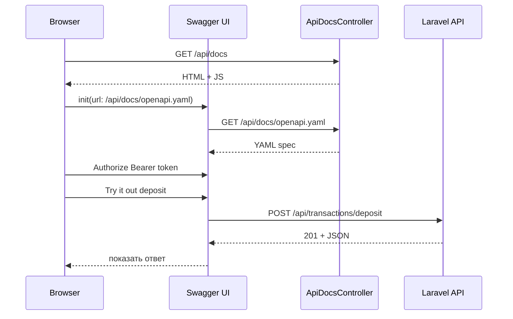

# Swagger: из чего состоит, как работает, основные моменты

Важно разделить два понятия, которые часто путают:

| Термин | Что это |
|--------|---------|
| **OpenAPI** (раньше Swagger Spec) | **Формат описания API** — YAML/JSON файл с paths, schemas, responses |
| **Swagger UI** | **Интерактивный viewer** — браузерная страница, которая читает OpenAPI и рисует документацию + «Try it out» |

В LedgerPay используется именно эта связка: **OpenAPI YAML как source of truth** + **Swagger UI как UI поверх него**.

---

## Из чего состоит (в проекте)

```text
docs/openapi/ledgerpay.openapi.yaml     ← описание API (OpenAPI 3.0)
         ↓
GET /api/docs/openapi.yaml              ← ApiDocsController::spec()
         ↓
GET /api/docs                           ← Swagger UI (HTML + JS с CDN)
         ↓
Браузер → Try it out → реальные запросы на http://localhost/api/...
```

### 1. OpenAPI spec (`ledgerpay.openapi.yaml`)

Это «контракт» API. Основные блоки:

| Секция | Назначение |
|--------|------------|
| `info` | Название, версия, общее описание |
| `servers` | Базовый URL (`http://localhost/api`) |
| `paths` | Эндпоинты: `/auth/login`, `/transactions/deposit`, … |
| `components` | Переиспользуемые части: schemas, responses, parameters |
| `security` | Глобальная auth (у вас — Bearer Sanctum) |

Пример path в spec:

```yaml
/transactions/deposit:
  post:
    parameters: [Idempotency-Key]
    requestBody: { target_account_uuid, amount, currency }
    responses:
      "201": создание
      "200": idempotent replay
      "422": validation error (Problem Details)
```

### 2. Swagger UI (`swagger.blade.php`)

Минимальная HTML-страница, которая:

- подключает JS/CSS Swagger UI с CDN;
- указывает URL spec: `route('api.docs.spec')`;
- включает `persistAuthorization` (токен сохраняется между запросами);
- включает `tryItOutEnabled` (кнопка «Execute»).

### 3. Backend-слой (`ApiDocsController` + config)

- **`config/api-docs.php`** — путь к YAML, включение/выключение;
- **`ApiDocsController`** — отдаёт HTML и YAML;
- **`.env`**: `API_DOCS_ENABLED`, `API_DOCS_LOCAL_ONLY`.

Swagger **не генерируется из PHP-кода** — контроллеры API и YAML живут отдельно. Это осознанный выбор: один файл-документ, без аннотаций в каждом методе.

---

## Как это работает (пошагово)

1. Вы открываете `http://localhost/api/docs`.
2. Laravel отдаёт HTML со Swagger UI.
3. Swagger UI делает `GET /api/docs/openapi.yaml` и парсит YAML.
4. UI строит список эндпоинтов по `tags` (Auth, Customers, Accounts, Transactions…).
5. Вы нажимаете **Authorize** → вводите `Bearer <token>` из `/auth/login`.
6. **Try it out** на `POST /transactions/deposit`:
    - Swagger собирает URL: `servers[0].url` + path → `http://localhost/api/transactions/deposit`;
    - добавляет заголовки: `Authorization`, `Idempotency-Key`, `Content-Type`;
    - отправляет реальный HTTP-запрос из браузера;
    - показывает status code и body ответа.



---

## Основные понятия OpenAPI

### Paths и operations

Каждый URL + HTTP-метод = **operation**:

- `GET /accounts` — list
- `POST /transactions/deposit` — create

### Parameters

- **path**: `{uuid}` в URL
- **header**: `Idempotency-Key`, `Authorization`
- **query**: фильтры (если есть)

### Request body

JSON-schema: какие поля обязательны, типы, примеры.

### Responses

Коды и форматы ответа. Для ошибок — `application/problem+json` с `ProblemDetails`.

### Components ($ref)

Чтобы не дублировать:

```yaml
"422":
  $ref: "#/components/responses/ValidationError"
```

Один раз описали `ValidationError` — переиспользуете везде.

### Security schemes

```yaml
bearerAuth:
  type: http
  scheme: bearer
```

Swagger UI рисует кнопку **Authorize**. Исключения — `security: []` на `/auth/login` и `/auth/register`.

---

## Основные моменты для LedgerPay

### 1. Spec ≠ реализация

OpenAPI описывает **ожидаемое** поведение. Если код изменился, а YAML — нет, документация «врёт». Поэтому spec держат рядом с API и обновляют в том же PR.

### 2. Idempotency в документации

В spec явно указано:

- **201** — новая транзакция;
- **200** — повтор с тем же `Idempotency-Key`.

Это важная деталь для fintech — клиенты должны знать, что повтор безопасен.

### 3. GET show vs list — разный формат

`GET /transactions/{uuid}` возвращает объект **в корне JSON**, а list/create — с обёрткой `data`. Это задокументировано в spec, но это нюанс API, который виден в Swagger при сравнении ответов.

### 4. Статусы транзакции

Spec включает `pending (ожидание)`, `processing (обработка)`, `completed (завершено)`, `failed (ошибка)`. `cancelled (отмененный)` — в enum зарезервирован, бизнес-логика MVP его не выставляет.

### 5. Swagger UI ≠ API gateway

Swagger только **документирует и тестирует**. Он не проксирует, не валидирует запросы на сервере, не заменяет Postman в production-мониторинге.

### 6. Безопасность

Сейчас:

- `API_DOCS_ENABLED=false` по умолчанию в `config/api-docs.php` (если env не задан);
- в `.env.example` для local Sail — `API_DOCS_ENABLED=true` (удобный dev out of the box);
- `API_DOCS_LOCAL_ONLY=true` — docs только в `local`.

В production Swagger обычно **выключен**, чтобы не светить поверхность API.

### 7. CORS при Try it out

Запросы идут **из браузера** на `localhost`. Если UI и API на разных origin — нужен CORS. В данном проекте всё на одном хосте — проблем нет.

---

## Быстрый сценарий в LedgerPay

1. `.env`: `API_DOCS_ENABLED=true`
2. Worker: `make worker`
3. `http://localhost/api/docs`
4. `POST /auth/login` → скопировать `access_token`
5. **Authorize** → `Bearer <token>`
6. `POST /accounts` → взять `uuid`
7. `POST /transactions/deposit` + `Idempotency-Key: deposit-demo-001`
8. Worker обработает → status `completed`

---

**Итог:** Swagger в данном проекте — это **OpenAPI YAML (контракт)** + **Swagger UI (интерактивная документация)** + **тонкий Laravel-слой для отдачи файлов**. Реальный API работает как обычно через `routes/api.php`; Swagger лишь помогает его понять, показать и протестировать локально.
