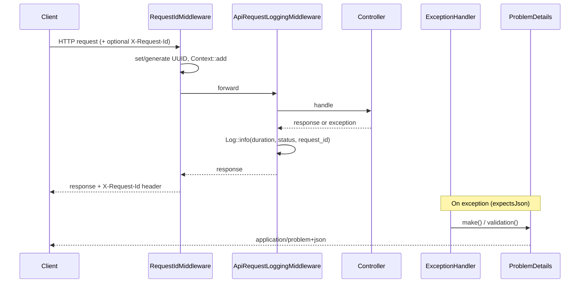

# Commit 5: API error handling, Problem Details, correlation id, structured logs

## Контекст

Сейчас в [`bootstrap/app.php`](../bootstrap/app.php) единственный API-обработчик — generic `DomainException` → `{ "message": "..." }` с HTTP **422**. Middleware для API не зарегистрированы. Директории `app/Support/` нет.

Commit 5 добавляет **RFC 7807 Problem Details**, **correlation id** (`X-Request-Id`), **structured API logging** и **structured job logging**.



## Адаптации под проект

| Черновик коммита | Реальный проект | Решение |
|------------------|-----------------|---------|
| `App\Domain\Transaction\Exceptions\{InsufficientFunds, InactiveAccount, CurrencyMismatch}` | `App\Domain\Account\Exceptions\` | Обновлять **существующие** файлы |
| Английские сообщения исключений | Русские сообщения | **Сохранить русские** тексты |
| Только 4 domain exceptions | + `InactiveCustomerException` | Добавить `implements DomainRuleViolation` |
| HTTP 422 для domain errors | Commit 5 → HTTP **409 Conflict** | Обновить 5 assertions в API-тестах |
| `$request->is('api/*')` | `$request->expectsJson()` | `AccountApiTest` blocked-customer → `postJson()` |
| `tests/Feature/ApiErrorHandlingTest.php` | API-тесты в `tests/Feature/Api/` | `tests/Feature/Api/ApiErrorHandlingTest.php` |

---

## Checklist

- [ ] Создать ветку `feature/005-api-error-handling-observability`
- [ ] `RequestIdMiddleware` + `ApiRequestLoggingMiddleware`
- [ ] `ProblemDetails` factory в `app/Support/Http/`
- [ ] `DomainRuleViolation` interface + обновить 5 domain exceptions
- [ ] Заменить `withExceptions` в `bootstrap/app.php`
- [ ] Structured logs в `ProcessTransactionJob`
- [ ] `ApiErrorHandlingTest` + обновить `TransactionApiTest` / `AccountApiTest`
- [ ] `sail artisan test` + `phpstan analyse`

---

## 1. Ветка

```bash
git checkout -b feature/005-api-error-handling-observability
```

---

## 2. RequestIdMiddleware

```bash
./vendor/bin/sail artisan make:middleware RequestIdMiddleware
```

### [`app/Http/Middleware/RequestIdMiddleware.php`](../app/Http/Middleware/RequestIdMiddleware.php)

```php
<?php

declare(strict_types=1);

namespace App\Http\Middleware;

use Closure;
use Illuminate\Http\Request;
use Illuminate\Support\Facades\Context;
use Illuminate\Support\Str;
use Symfony\Component\HttpFoundation\Response;

final class RequestIdMiddleware
{
    public function handle(Request $request, Closure $next): Response
    {
        $requestId = $request->headers->get('X-Request-Id');

        if (! is_string($requestId) || trim($requestId) === '') {
            $requestId = (string) Str::uuid();
        }

        $request->headers->set('X-Request-Id', $requestId);

        Context::add('request_id', $requestId);

        /** @var Response $response */
        $response = $next($request);

        $response->headers->set('X-Request-Id', $requestId);

        return $response;
    }
}
```

---

## 3. ApiRequestLoggingMiddleware

```bash
./vendor/bin/sail artisan make:middleware ApiRequestLoggingMiddleware
```

### [`app/Http/Middleware/ApiRequestLoggingMiddleware.php`](../app/Http/Middleware/ApiRequestLoggingMiddleware.php)

```php
<?php

declare(strict_types=1);

namespace App\Http\Middleware;

use Closure;
use Illuminate\Http\Request;
use Illuminate\Support\Facades\Log;
use Symfony\Component\HttpFoundation\Response;

final class ApiRequestLoggingMiddleware
{
    public function handle(Request $request, Closure $next): Response
    {
        $startedAt = microtime(true);

        /** @var Response $response */
        $response = $next($request);

        Log::info('API request handled.', [
            'request_id' => $request->headers->get('X-Request-Id'),
            'method' => $request->method(),
            'path' => $request->path(),
            'status' => $response->getStatusCode(),
            'duration_ms' => (int) round((microtime(true) - $startedAt) * 1000),
            'ip' => $request->ip(),
        ]);

        return $response;
    }
}
```

> **Порядок middleware:** `RequestIdMiddleware` → `ApiRequestLoggingMiddleware`.

---

## 4. ProblemDetails factory

```bash
mkdir -p app/Support/Http
```

### [`app/Support/Http/ProblemDetails.php`](../app/Support/Http/ProblemDetails.php)

```php
<?php

declare(strict_types=1);

namespace App\Support\Http;

use Illuminate\Http\JsonResponse;
use Illuminate\Http\Request;
use Symfony\Component\HttpFoundation\Response;

final class ProblemDetails
{
    public static function make(
        Request $request,
        string $title,
        string $detail,
        int $status,
        string $type = 'about:blank',
        ?array $errors = null,
    ): JsonResponse {
        $payload = [
            'type' => $type,
            'title' => $title,
            'status' => $status,
            'detail' => $detail,
            'instance' => $request->path(),
            'request_id' => $request->headers->get('X-Request-Id'),
        ];

        if ($errors !== null) {
            $payload['errors'] = $errors;
        }

        return response()->json(
            data: $payload,
            status: $status,
            headers: [
                'Content-Type' => 'application/problem+json',
            ],
        );
    }

    public static function validation(
        Request $request,
        array $errors,
    ): JsonResponse {
        return self::make(
            request: $request,
            title: 'Validation failed',
            detail: 'The request payload contains invalid data.',
            status: Response::HTTP_UNPROCESSABLE_ENTITY,
            type: 'https://ledgerpay.local/problems/validation-failed',
            errors: $errors,
        );
    }
}
```

---

## 5. DomainRuleViolation marker

```bash
mkdir -p app/Domain/Shared/Exceptions
```

### [`app/Domain/Shared/Exceptions/DomainRuleViolation.php`](../app/Domain/Shared/Exceptions/DomainRuleViolation.php)

```php
<?php

declare(strict_types=1);

namespace App\Domain\Shared\Exceptions;

interface DomainRuleViolation
{
    public function getMessage(): string;
}
```

### Обновить 5 существующих exceptions

Добавить `use App\Domain\Shared\Exceptions\DomainRuleViolation;` и `implements DomainRuleViolation`. **Сообщения оставить на русском.**

#### [`app/Domain/Account/Exceptions/InsufficientFundsException.php`](../app/Domain/Account/Exceptions/InsufficientFundsException.php)

```php
<?php

declare(strict_types=1);

namespace App\Domain\Account\Exceptions;

use App\Domain\Shared\Exceptions\DomainRuleViolation;
use DomainException;

final class InsufficientFundsException extends DomainException implements DomainRuleViolation
{
    public function __construct()
    {
        parent::__construct('Недостаточно средств.');
    }
}
```

#### [`app/Domain/Account/Exceptions/InactiveAccountException.php`](../app/Domain/Account/Exceptions/InactiveAccountException.php)

```php
<?php

declare(strict_types=1);

namespace App\Domain\Account\Exceptions;

use App\Domain\Shared\Exceptions\DomainRuleViolation;
use DomainException;

final class InactiveAccountException extends DomainException implements DomainRuleViolation
{
    public function __construct()
    {
        parent::__construct('Счет неактивен.');
    }
}
```

#### [`app/Domain/Account/Exceptions/CurrencyMismatchException.php`](../app/Domain/Account/Exceptions/CurrencyMismatchException.php)

```php
<?php

declare(strict_types=1);

namespace App\Domain\Account\Exceptions;

use App\Domain\Shared\Exceptions\DomainRuleViolation;
use DomainException;

final class CurrencyMismatchException extends DomainException implements DomainRuleViolation
{
    public function __construct()
    {
        parent::__construct('Валюта операции не совпадает с валютой счета.');
    }
}
```

#### [`app/Domain/Transaction/Exceptions/SameAccountTransferException.php`](../app/Domain/Transaction/Exceptions/SameAccountTransferException.php)

```php
<?php

declare(strict_types=1);

namespace App\Domain\Transaction\Exceptions;

use App\Domain\Shared\Exceptions\DomainRuleViolation;
use DomainException;

final class SameAccountTransferException extends DomainException implements DomainRuleViolation
{
    public function __construct()
    {
        parent::__construct('Попытка перевода на тот же счет.');
    }
}
```

#### [`app/Domain/Customer/Exceptions/InactiveCustomerException.php`](../app/Domain/Customer/Exceptions/InactiveCustomerException.php)

```php
<?php

declare(strict_types=1);

namespace App\Domain\Customer\Exceptions;

use App\Domain\Shared\Exceptions\DomainRuleViolation;
use DomainException;

final class InactiveCustomerException extends DomainException implements DomainRuleViolation
{
    public function __construct()
    {
        parent::__construct('Не удается открыть счет для неактивного клиента.');
    }
}
```

---

## 6. bootstrap/app.php — middleware + exception rendering

### Итоговый файл [`bootstrap/app.php`](../bootstrap/app.php)

```php
<?php

use App\Domain\Shared\Exceptions\DomainRuleViolation;
use App\Http\Middleware\ApiRequestLoggingMiddleware;
use App\Http\Middleware\HandleInertiaRequests;
use App\Http\Middleware\RequestIdMiddleware;
use App\Support\Http\ProblemDetails;
use Illuminate\Auth\AuthenticationException;
use Illuminate\Database\Eloquent\ModelNotFoundException;
use Illuminate\Foundation\Application;
use Illuminate\Foundation\Configuration\Exceptions;
use Illuminate\Foundation\Configuration\Middleware;
use Illuminate\Http\Middleware\AddLinkHeadersForPreloadedAssets;
use Illuminate\Http\Request;
use Illuminate\Support\Facades\Log;
use Illuminate\Validation\ValidationException;
use Symfony\Component\HttpFoundation\Response;
use Symfony\Component\HttpKernel\Exception\HttpExceptionInterface;
use Throwable;

return Application::configure(basePath: dirname(__DIR__))
    ->withRouting(
        web: __DIR__.'/../routes/web.php',
        api: __DIR__.'/../routes/api.php',
        commands: __DIR__.'/../routes/console.php',
        health: '/up',
    )
    ->withMiddleware(function (Middleware $middleware): void {
        $middleware->web(append: [
            HandleInertiaRequests::class,
            AddLinkHeadersForPreloadedAssets::class,
        ]);

        $middleware->api(append: [
            RequestIdMiddleware::class,
            ApiRequestLoggingMiddleware::class,
        ]);
    })
    ->withExceptions(function (Exceptions $exceptions): void {
        $exceptions->render(function (ValidationException $exception, Request $request) {
            if (! $request->expectsJson()) {
                return null;
            }

            return ProblemDetails::validation(
                request: $request,
                errors: $exception->errors(),
            );
        });

        $exceptions->render(function (ModelNotFoundException $exception, Request $request) {
            if (! $request->expectsJson()) {
                return null;
            }

            return ProblemDetails::make(
                request: $request,
                title: 'Resource not found',
                detail: 'The requested resource does not exist.',
                status: Response::HTTP_NOT_FOUND,
                type: 'https://ledgerpay.local/problems/resource-not-found',
            );
        });

        $exceptions->render(function (DomainRuleViolation $exception, Request $request) {
            if (! $request->expectsJson()) {
                return null;
            }

            return ProblemDetails::make(
                request: $request,
                title: 'Domain rule violation',
                detail: $exception->getMessage(),
                status: Response::HTTP_CONFLICT,
                type: 'https://ledgerpay.local/problems/domain-rule-violation',
            );
        });

        $exceptions->render(function (AuthenticationException $exception, Request $request) {
            if (! $request->expectsJson()) {
                return null;
            }

            return ProblemDetails::make(
                request: $request,
                title: 'Unauthenticated',
                detail: 'Authentication is required.',
                status: Response::HTTP_UNAUTHORIZED,
                type: 'https://ledgerpay.local/problems/unauthenticated',
            );
        });

        $exceptions->render(function (Throwable $exception, Request $request) {
            if (! $request->expectsJson()) {
                return null;
            }

            $status = $exception instanceof HttpExceptionInterface
                ? $exception->getStatusCode()
                : Response::HTTP_INTERNAL_SERVER_ERROR;

            Log::error('Unhandled API exception.', [
                'request_id' => $request->headers->get('X-Request-Id'),
                'exception_class' => $exception::class,
                'message' => $exception->getMessage(),
                'path' => $request->path(),
                'method' => $request->method(),
            ]);

            return ProblemDetails::make(
                request: $request,
                title: $status >= 500 ? 'Internal server error' : 'HTTP error',
                detail: $status >= 500
                    ? 'An unexpected error occurred.'
                    : $exception->getMessage(),
                status: $status,
                type: 'https://ledgerpay.local/problems/http-error',
            );
        });
    })->create();
```

> Удалить старый `DomainException` renderer (422 + `{ message }`).

---

## 7. ProcessTransactionJob — structured logs

В [`app/Application/Transaction/Jobs/ProcessTransactionJob.php`](../app/Application/Transaction/Jobs/ProcessTransactionJob.php):

**Добавить import:**

```php
use Illuminate\Support\Facades\Log;
```

**Итоговый `handle()`:**

```php
public function handle(TransactionProcessorService $processor): void
{
    Log::info('Transaction processing started.', [
        'transaction_id' => $this->transactionId,
    ]);

    $transaction = Transaction::query()->find($this->transactionId);

    if (! $transaction instanceof Transaction) {
        throw new ModelNotFoundException('Транзакция не найдена.');
    }

    if ($transaction->status === TransactionStatus::Completed) {
        return;
    }

    if ($transaction->status === TransactionStatus::Failed) {
        return;
    }

    $processor->process($transaction);

    Log::info('Transaction processing completed.', [
        'transaction_id' => $this->transactionId,
    ]);
}
```

**В `failed()` — перед `$transaction->update(...)`:**

```php
Log::error('Transaction processing failed.', [
    'transaction_id' => $this->transactionId,
    'exception_class' => $exception::class,
    'message' => $exception->getMessage(),
]);
```

---

## 8. Тесты

### Новый файл

```bash
./vendor/bin/sail artisan make:test Api/ApiErrorHandlingTest
```

### [`tests/Feature/Api/ApiErrorHandlingTest.php`](../tests/Feature/Api/ApiErrorHandlingTest.php)

```php
<?php

declare(strict_types=1);

namespace Tests\Feature\Api;

use App\Domain\Account\Enums\AccountStatus;
use App\Domain\Account\Models\Account;
use Illuminate\Foundation\Testing\RefreshDatabase;
use Illuminate\Support\Facades\Queue;
use Tests\Feature\Api\Concerns\CreatesApiFixtures;
use Tests\TestCase;

final class ApiErrorHandlingTest extends TestCase
{
    use CreatesApiFixtures;
    use RefreshDatabase;

    public function test_validation_errors_are_returned_as_problem_details(): void
    {
        Queue::fake();

        $response = $this->postJson('/api/transactions/deposit', [], [
            'X-Request-Id' => 'test-request-id-001',
        ]);

        $response->assertStatus(422)
            ->assertHeader('Content-Type', 'application/problem+json')
            ->assertHeader('X-Request-Id', 'test-request-id-001')
            ->assertJsonPath('title', 'Validation failed')
            ->assertJsonPath('status', 422)
            ->assertJsonPath('request_id', 'test-request-id-001')
            ->assertJsonStructure([
                'type',
                'title',
                'status',
                'detail',
                'instance',
                'request_id',
                'errors',
            ]);
    }

    public function test_not_found_errors_are_returned_as_problem_details(): void
    {
        $response = $this->getJson('/api/accounts/00000000-0000-0000-0000-000000000000', [
            'X-Request-Id' => 'test-request-id-404',
        ]);

        $response->assertNotFound()
            ->assertHeader('Content-Type', 'application/problem+json')
            ->assertHeader('X-Request-Id', 'test-request-id-404')
            ->assertJsonPath('title', 'Resource not found')
            ->assertJsonPath('status', 404)
            ->assertJsonPath('request_id', 'test-request-id-404');
    }

    public function test_request_id_is_generated_when_header_is_missing(): void
    {
        $account = Account::factory()->create();

        $response = $this->getJson('/api/accounts/' . $account->uuid);

        $response->assertOk();

        $this->assertNotEmpty($response->headers->get('X-Request-Id'));
    }

    public function test_domain_rule_violations_are_returned_as_problem_details(): void
    {
        $account = $this->createAccount(
            $this->createCustomer(),
            status: AccountStatus::Blocked,
        );

        $response = $this->postJson('/api/transactions/deposit', [
            'target_account_uuid' => $account->uuid,
            'amount' => 1000,
            'currency' => 'USD',
        ], $this->idempotencyHeaders('deposit-inactive-error-handling'));

        $response->assertConflict()
            ->assertHeader('Content-Type', 'application/problem+json')
            ->assertJsonPath('title', 'Domain rule violation')
            ->assertJsonPath('status', 409)
            ->assertJsonPath('detail', 'Счет неактивен.');
    }
}
```

### Обновить существующие API-тесты

**[`tests/Feature/Api/TransactionApiTest.php`](../tests/Feature/Api/TransactionApiTest.php)** — 4 теста:

```php
$response->assertConflict()
    ->assertHeader('Content-Type', 'application/problem+json')
    ->assertJsonPath('title', 'Domain rule violation')
    ->assertJsonPath('status', 409)
    ->assertJsonPath('detail', '...');
```

| Тест | `detail` |
|------|----------|
| `test_deposit_fails_for_inactive_account` | `Счет неактивен.` |
| `test_deposit_fails_for_currency_mismatch` | `Валюта операции не совпадает с валютой счета.` |
| `test_withdraw_fails_when_insufficient_funds` | `Недостаточно средств.` |
| `test_transfer_fails_when_insufficient_funds` | `Недостаточно средств.` |

**[`tests/Feature/Api/AccountApiTest.php`](../tests/Feature/Api/AccountApiTest.php)** — `test_cannot_create_account_for_blocked_customer`:

```php
$response = $this->postJson('/api/accounts', $data);

$response->assertConflict()
    ->assertHeader('Content-Type', 'application/problem+json')
    ->assertJsonPath('title', 'Domain rule violation')
    ->assertJsonPath('status', 409)
    ->assertJsonPath('detail', 'Не удается открыть счет для неактивного клиента.');
```

> Validation-тесты с `assertJsonValidationErrors()` продолжат работать — ключ `errors` в корне Problem Details payload.

---

## 9. Ручная проверка

```bash
curl -i -X POST http://localhost/api/transactions/deposit \
  -H "Content-Type: application/json" \
  -H "Accept: application/json" \
  -H "X-Request-Id: local-test-001" \
  -d '{}'
```

Ожидаемый формат:

```json
{
  "type": "https://ledgerpay.local/problems/validation-failed",
  "title": "Validation failed",
  "status": 422,
  "detail": "The request payload contains invalid data.",
  "instance": "api/transactions/deposit",
  "request_id": "local-test-001",
  "errors": {
    "target_account_uuid": [
      "The target account uuid field is required."
    ]
  }
}
```

---

## 10. Верификация

```bash
./vendor/bin/sail artisan test
./vendor/bin/sail php vendor/bin/phpstan analyse
```

---

## 11. Commit

```bash
Задача: Сделать единый формат ошибок API, добавить request id и логирование

- Support: добавлен единый формат ответа об ошибке (Problem Details) — всегда одинаковая JSON-структура с type, title, status, detail, request_id;

- HTTP: каждый API-запрос получает X-Request-Id (из заголовка или новый UUID), id возвращается в ответе и попадает в логи;

- HTTP: после каждого API-запроса пишется лог — метод, путь, статус, время выполнения;

- HTTP: переписана обработка ошибок — валидация → 422, не найдено → 404, нарушение бизнес-правила → 409 (раньше было 422), не авторизован → 401, остальное → стандартный fallback;

- Tests: новые тесты на формат ошибок, request id и domain-ошибки;

- Tests: обновлены тесты транзакций и счетов — проверяют 409 и новый формат ошибки вместо старого { message }.
```

---

## Файлы: сводка

**Создать (5):**

- `app/Http/Middleware/RequestIdMiddleware.php`
- `app/Http/Middleware/ApiRequestLoggingMiddleware.php`
- `app/Support/Http/ProblemDetails.php`
- `app/Domain/Shared/Exceptions/DomainRuleViolation.php`
- `tests/Feature/Api/ApiErrorHandlingTest.php`

**Изменить (9):**

- `bootstrap/app.php`
- `app/Application/Transaction/Jobs/ProcessTransactionJob.php`
- `app/Domain/Account/Exceptions/InsufficientFundsException.php`
- `app/Domain/Account/Exceptions/InactiveAccountException.php`
- `app/Domain/Account/Exceptions/CurrencyMismatchException.php`
- `app/Domain/Transaction/Exceptions/SameAccountTransferException.php`
- `app/Domain/Customer/Exceptions/InactiveCustomerException.php`
- `tests/Feature/Api/TransactionApiTest.php`
- `tests/Feature/Api/AccountApiTest.php`

**Не трогать:**

- Controllers, Services, Routes — логика не меняется
