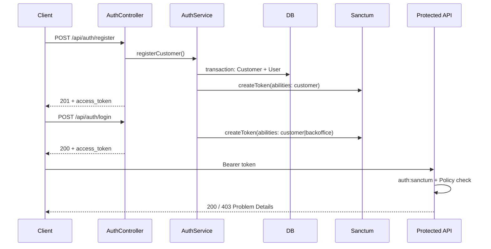

# Commit 6: Laravel Sanctum auth, users → customers, API tokens, policies

## Контекст

Сейчас API в [`routes/api.php`](../routes/api.php) **полностью открыт** — без `auth:sanctum`. Модель [`User`](../app/Models/User.php) не связана с `Customer`, policies нет, `$this->authorize()` в контроллерах не используется (базовый [`Controller`](../app/Http/Controllers/Controller.php) без `AuthorizesRequests`).

Sanctum **уже частично установлен** (Breeze): пакет в `composer.json`, [`config/sanctum.php`](../config/sanctum.php), миграция `personal_access_tokens`. Commit 6 добавляет **API auth**, связь `users.customer_id`, **policies** и защищает все бизнес-маршруты.



## Адаптации под проект

| Черновик коммита | Реальный проект | Решение |
|------------------|-----------------|---------|
| `composer require laravel/sanctum` + publish | Уже установлен (Breeze) | Только `migrate` для `customer_id`; publish **не нужен** |
| `CreateAccountData(customerId: ...)` | `CreateAccountData(customerUuid: ...)` | **Не менять DTO/Service** — в контроллере резолвить customer и передавать `$customer->uuid` |
| `App\Http\Resources\{Customer,Account,...}Resource` | `App\Http\Resources\{Customer,Account,...}\*Resource` | Использовать **существующие namespaces** |
| `LoginRequest` для API | Breeze [`LoginRequest`](../app/Http/Requests/Auth/LoginRequest.php) для web `/login` | Создать **`ApiLoginRequest`** — не перезаписывать Breeze |
| `AccountController::store()` → `AccountResource` | Возвращает `JsonResponse` с `HTTP_CREATED` | **Сохранить** текущий формат ответа |
| `TransactionController::show()` → `TransactionResource` | Возвращает `TransactionResource::make()->resolve()` (без `data`-wrapper) | **Сохранить** unwrapped JSON |
| `StoreAccountRequest` — только `size:3` | Есть `regex:/^[A-Za-z]{3}$/` | Сохранить regex при изменении `customer_uuid` → `nullable` |
| `User` с `$fillable` | PHP attributes `#[Fillable]` | Добавить `customer_id` в `#[Fillable]`, не ломать стиль |
| `tests/Feature/AuthApiTest.php` | API-тесты в `tests/Feature/Api/` | `tests/Feature/Api/AuthApiTest.php` |
| `DomainRuleViolation` | `IDomainRuleViolation` | Не трогать — уже есть из Commit 5 |
| Named routes (`api.accounts.store`) | Используются в тестах | **Сохранить** `->name()` при добавлении middleware |
| `test_can_list_accounts/transactions` | `viewAny` только для backoffice | В list-тестах — `actingAs` backoffice user |
| `CreatesApiFixtures::depositToAccount()` | Без auth | Вызывать `actingAsCustomerFor()` до deposit |

---

## Checklist

- [ ] Создать ветку `feature/006-auth-sanctum-policies`
- [ ] Миграция `customer_id` на `users`
- [ ] Обновить `User` + `UserFactory` (HasApiTokens, customer relation, isBackOffice)
- [ ] Auth layer: DTO, AuthService, ApiLoginRequest, RegisterRequest, AuthController
- [ ] Policies + AuthServiceProvider + `AuthorizesRequests` в Controller
- [ ] Защитить `routes/api.php` (`auth:sanctum`)
- [ ] Authorization в AccountController / TransactionController + pre-check счетов
- [ ] `AuthorizationException` → Problem Details 403 в `bootstrap/app.php`
- [ ] Тесты: AuthApiTest, AccountAuthorizationTest + обновить существующие API-тесты
- [ ] `sail artisan migrate` + `sail artisan test` + `phpstan analyse`

---

## 1. Ветка

```bash
git checkout -b feature/006-auth-sanctum-policies
```

---

## 2. Sanctum — проверка (без переустановки)

Sanctum уже в проекте. Достаточно убедиться, что миграции применены:

```bash
./vendor/bin/sail artisan migrate
```

> Файлы уже есть: [`config/sanctum.php`](../config/sanctum.php), [`database/migrations/2026_05_10_174055_create_personal_access_tokens_table.php`](../database/migrations/2026_05_10_174055_create_personal_access_tokens_table.php).

---

## 3. Миграция `customer_id` на users

```bash
./vendor/bin/sail artisan make:migration add_customer_id_to_users_table
```

### `database/migrations/xxxx_xx_xx_xxxxxx_add_customer_id_to_users_table.php`

```php
<?php

declare(strict_types=1);

use Illuminate\Database\Migrations\Migration;
use Illuminate\Database\Schema\Blueprint;
use Illuminate\Support\Facades\Schema;

return new class extends Migration
{
    public function up(): void
    {
        Schema::table('users', function (Blueprint $table): void {
            $table->foreignId('customer_id')
                ->nullable()
                ->after('id')
                ->constrained('customers')
                ->nullOnDelete();

            $table->index('customer_id');
        });
    }

    public function down(): void
    {
        Schema::table('users', function (Blueprint $table): void {
            $table->dropConstrainedForeignId('customer_id');
        });
    }
};
```

**Логика:** `customer_id !== null` — клиент; `customer_id === null` — backoffice/admin.

---

## 4. Обновить User

### [`app/Models/User.php`](../app/Models/User.php)

```php
<?php

namespace App\Models;

use App\Domain\Customer\Models\Customer;
use Database\Factories\UserFactory;
use Illuminate\Database\Eloquent\Attributes\Fillable;
use Illuminate\Database\Eloquent\Attributes\Hidden;
use Illuminate\Database\Eloquent\Factories\HasFactory;
use Illuminate\Database\Eloquent\Relations\BelongsTo;
use Illuminate\Foundation\Auth\User as Authenticatable;
use Illuminate\Notifications\Notifiable;
use Laravel\Sanctum\HasApiTokens;

#[Fillable(['customer_id', 'name', 'email', 'password'])]
#[Hidden(['password', 'remember_token'])]
class User extends Authenticatable
{
    /** @use HasFactory<UserFactory> */
    use HasApiTokens, HasFactory, Notifiable;

    protected function casts(): array
    {
        return [
            'email_verified_at' => 'datetime',
            'password' => 'hashed',
        ];
    }

    public function customer(): BelongsTo
    {
        return $this->belongsTo(Customer::class);
    }

    public function isBackOffice(): bool
    {
        return $this->customer_id === null;
    }
}
```

### [`database/factories/UserFactory.php`](../database/factories/UserFactory.php) — states

```php
use App\Domain\Customer\Models\Customer;

public function forCustomer(Customer $customer): static
{
    return $this->state([
        'customer_id' => $customer->id,
    ]);
}

public function backoffice(): static
{
    return $this->state([
        'customer_id' => null,
    ]);
}
```

---

## 5. Auth DTO

```bash
mkdir -p app/Application/Auth/DTO
mkdir -p app/Application/Auth/Services
mkdir -p app/Http/Requests/Auth
```

### [`app/Application/Auth/DTO/RegisterCustomerUserData.php`](../app/Application/Auth/DTO/RegisterCustomerUserData.php)

```php
<?php

declare(strict_types=1);

namespace App\Application\Auth\DTO;

final readonly class RegisterCustomerUserData
{
    public function __construct(
        public string $name,
        public string $email,
        public string $password,
    ) {}
}
```

### [`app/Application/Auth/DTO/LoginData.php`](../app/Application/Auth/DTO/LoginData.php)

```php
<?php

declare(strict_types=1);

namespace App\Application\Auth\DTO;

final readonly class LoginData
{
    public function __construct(
        public string $email,
        public string $password,
        public string $deviceName,
    ) {}
}
```

---

## 6. AuthService

### [`app/Application/Auth/Services/AuthService.php`](../app/Application/Auth/Services/AuthService.php)

```php
<?php

declare(strict_types=1);

namespace App\Application\Auth\Services;

use App\Application\Auth\DTO\LoginData;
use App\Application\Auth\DTO\RegisterCustomerUserData;
use App\Domain\Customer\Enums\CustomerStatus;
use App\Domain\Customer\Models\Customer;
use App\Models\User;
use Illuminate\Support\Facades\DB;
use Illuminate\Support\Facades\Hash;
use Illuminate\Validation\ValidationException;

final class AuthService
{
    /**
     * Создает Customer + User атомарно.
     *
     * Регистрация пользователя и создание customer-профиля
     * не должны расходиться по состоянию.
     */
    public function registerCustomer(RegisterCustomerUserData $data): array
    {
        return DB::transaction(function () use ($data): array {
            $customer = Customer::query()->create([
                'name'   => $data->name,
                'email'  => $data->email,
                'status' => CustomerStatus::Active,
            ]);

            $user = User::query()->create([
                'customer_id' => $customer->id,
                'name'        => $data->name,
                'email'       => $data->email,
                'password'    => $data->password,
            ]);

            $token = $user->createToken(
                name: 'default',
                abilities: ['customer'],
            )->plainTextToken;

            return [
                'user'     => $user,
                'customer' => $customer,
                'token'    => $token,
            ];
        });
    }

    public function login(LoginData $data): array
    {
        $user = User::query()
            ->where('email', $data->email)
            ->first();

        if (! $user instanceof User || ! Hash::check($data->password, $user->password)) {
            throw ValidationException::withMessages([
                'email' => ['The provided credentials are incorrect.'],
            ]);
        }

        $abilities = $user->isBackOffice()
            ? ['backoffice']
            : ['customer'];

        $token = $user->createToken(
            name: $data->deviceName,
            abilities: $abilities,
        )->plainTextToken;

        return [
            'user'  => $user,
            'token' => $token,
        ];
    }

    public function logout(User $user): void
    {
        $user->currentAccessToken()?->delete();
    }
}
```

---

## 7. Auth Requests

### [`app/Http/Requests/Auth/RegisterRequest.php`](../app/Http/Requests/Auth/RegisterRequest.php) — новый

```php
<?php

declare(strict_types=1);

namespace App\Http\Requests\Auth;

use Illuminate\Foundation\Http\FormRequest;
use Illuminate\Validation\Rules\Password;

final class RegisterRequest extends FormRequest
{
    public function authorize(): bool
    {
        return true;
    }

    public function rules(): array
    {
        return [
            'name' => ['required', 'string', 'min:2', 'max:255'],
            'email' => [
                'required',
                'email:rfc,dns',
                'max:255',
                'unique:users,email',
                'unique:customers,email',
            ],
            'password' => [
                'required',
                'string',
                Password::min(12)
                    ->mixedCase()
                    ->numbers()
                    ->symbols()
                    ->uncompromised(),
            ],
        ];
    }
}
```

### [`app/Http/Requests/Auth/ApiLoginRequest.php`](../app/Http/Requests/Auth/ApiLoginRequest.php) — новый

> **Не перезаписывать** Breeze [`LoginRequest`](../app/Http/Requests/Auth/LoginRequest.php) — он используется web `/login`.

```php
<?php

declare(strict_types=1);

namespace App\Http\Requests\Auth;

use Illuminate\Foundation\Http\FormRequest;

final class ApiLoginRequest extends FormRequest
{
    public function authorize(): bool
    {
        return true;
    }

    public function rules(): array
    {
        return [
            'email'       => ['required', 'email'],
            'password'    => ['required', 'string'],
            'device_name' => ['nullable', 'string', 'max:255'],
        ];
    }

    public function deviceName(): string
    {
        return $this->string('device_name')->toString() ?: 'api-client';
    }
}
```

---

## 8. AuthController

```bash
# Файл создать вручную
```

### [`app/Http/Controllers/Api/AuthController.php`](../app/Http/Controllers/Api/AuthController.php)

```php
<?php

declare(strict_types=1);

namespace App\Http\Controllers\Api;

use App\Application\Auth\DTO\LoginData;
use App\Application\Auth\DTO\RegisterCustomerUserData;
use App\Application\Auth\Services\AuthService;
use App\Http\Controllers\Controller;
use App\Http\Requests\Auth\ApiLoginRequest;
use App\Http\Requests\Auth\RegisterRequest;
use App\Http\Resources\Customer\CustomerResource;
use Illuminate\Http\JsonResponse;
use Illuminate\Http\Request;

final class AuthController extends Controller
{
    public function register(
        RegisterRequest $request,
        AuthService $service,
    ): JsonResponse {
        $result = $service->registerCustomer(
            new RegisterCustomerUserData(
                name: $request->string('name')->toString(),
                email: $request->string('email')->toString(),
                password: $request->string('password')->toString(),
            )
        );

        return response()->json([
            'token_type'   => 'Bearer',
            'access_token' => $result['token'],
            'user'         => [
                'name'  => $result['user']->name,
                'email' => $result['user']->email,
            ],
            'customer' => new CustomerResource($result['customer']),
        ], 201);
    }

    public function login(
        ApiLoginRequest $request,
        AuthService $service,
    ): JsonResponse {
        $result = $service->login(
            new LoginData(
                email: $request->string('email')->toString(),
                password: $request->string('password')->toString(),
                deviceName: $request->deviceName(),
            )
        );

        return response()->json([
            'token_type'   => 'Bearer',
            'access_token' => $result['token'],
            'user'         => [
                'name'          => $result['user']->name,
                'email'         => $result['user']->email,
                'is_backoffice' => $result['user']->isBackOffice(),
            ],
        ]);
    }

    public function me(Request $request): JsonResponse
    {
        $user = $request->user();

        return response()->json([
            'user' => [
                'name'          => $user->name,
                'email'         => $user->email,
                'is_backoffice' => $user->isBackOffice(),
            ],
            'customer' => $user->customer
                ? new CustomerResource($user->customer)
                : null,
        ]);
    }

    public function logout(
        Request $request,
        AuthService $service,
    ): JsonResponse {
        $service->logout($request->user());

        return response()->json([
            'message' => 'Logged out.',
        ]);
    }
}
```

---

## 9. AuthorizesRequests в базовом Controller

### [`app/Http/Controllers/Controller.php`](../app/Http/Controllers/Controller.php)

```php
<?php

namespace App\Http\Controllers;

use Illuminate\Foundation\Auth\Access\AuthorizesRequests;

abstract class Controller
{
    use AuthorizesRequests;
}
```

---

## 10. Policies

```bash
./vendor/bin/sail artisan make:policy AccountPolicy
./vendor/bin/sail artisan make:policy TransactionPolicy
```

### [`app/Policies/AccountPolicy.php`](../app/Policies/AccountPolicy.php)

```php
<?php

declare(strict_types=1);

namespace App\Policies;

use App\Domain\Account\Models\Account;
use App\Models\User;

final class AccountPolicy
{
    public function viewAny(User $user): bool
    {
        return $user->isBackOffice();
    }

    public function view(User $user, Account $account): bool
    {
        if ($user->isBackOffice()) {
            return true;
        }

        return $user->customer_id === $account->customer_id;
    }

    public function create(User $user): bool
    {
        return $user->isBackOffice() || $user->customer_id !== null;
    }
}
```

### [`app/Policies/TransactionPolicy.php`](../app/Policies/TransactionPolicy.php)

```php
<?php

declare(strict_types=1);

namespace App\Policies;

use App\Domain\Transaction\Models\Transaction;
use App\Models\User;

final class TransactionPolicy
{
    public function viewAny(User $user): bool
    {
        return $user->isBackOffice();
    }

    public function view(User $user, Transaction $transaction): bool
    {
        if ($user->isBackOffice()) {
            return true;
        }

        $customerId = $user->customer_id;

        return $transaction->sourceAccount?->customer_id === $customerId
            || $transaction->targetAccount?->customer_id === $customerId;
    }

    public function create(User $user): bool
    {
        return $user->isBackOffice() || $user->customer_id !== null;
    }

    public function retry(User $user, Transaction $transaction): bool
    {
        return $this->view($user, $transaction);
    }
}
```

> Модели в `App\Domain\*`, auto-discovery не сработает — нужна явная регистрация.

---

## 11. AuthServiceProvider

```bash
./vendor/bin/sail artisan make:provider AuthServiceProvider
```

### [`app/Providers/AuthServiceProvider.php`](../app/Providers/AuthServiceProvider.php)

```php
<?php

declare(strict_types=1);

namespace App\Providers;

use App\Domain\Account\Models\Account;
use App\Domain\Transaction\Models\Transaction;
use App\Policies\AccountPolicy;
use App\Policies\TransactionPolicy;
use Illuminate\Foundation\Support\Providers\AuthServiceProvider as ServiceProvider;

final class AuthServiceProvider extends ServiceProvider
{
    protected $policies = [
        Account::class     => AccountPolicy::class,
        Transaction::class => TransactionPolicy::class,
    ];
}
```

### [`bootstrap/providers.php`](../bootstrap/providers.php)

```php
<?php

return [
    App\Providers\AppServiceProvider::class,
    App\Providers\AuthServiceProvider::class,
];
```

---

## 12. Защита routes (с сохранением имён)

### [`routes/api.php`](../routes/api.php)

```php
<?php

declare(strict_types=1);

use App\Http\Controllers\Api\AccountController;
use App\Http\Controllers\Api\AuthController;
use App\Http\Controllers\Api\CustomerController;
use App\Http\Controllers\Api\TransactionController;
use Illuminate\Support\Facades\Route;

Route::prefix('auth')->name('api.auth.')->group(function (): void {
    Route::post('/register', [AuthController::class, 'register'])->name('register');
    Route::post('/login', [AuthController::class, 'login'])->name('login');

    Route::middleware('auth:sanctum')->group(function (): void {
        Route::get('/me', [AuthController::class, 'me'])->name('me');
        Route::post('/logout', [AuthController::class, 'logout'])->name('logout');
    });
});

Route::middleware('auth:sanctum')->group(function (): void {
    Route::controller(CustomerController::class)->prefix('customers')->name('api.customers.')->group(function (): void {
        Route::get('/', 'index')->name('index');
        Route::post('/', 'store')->name('store');
        Route::get('/{uuid}', 'show')->whereUuid('uuid')->name('show');
    });

    Route::controller(AccountController::class)->prefix('accounts')->name('api.accounts.')->group(function (): void {
        Route::get('/', 'index')->name('index');
        Route::post('/', 'store')->name('store');
        Route::get('/{uuid}', 'show')->whereUuid('uuid')->name('show');
        Route::get('/{uuid}/balance', 'balance')->whereUuid('uuid')->name('balance');
        Route::get('/{uuid}/ledger', 'ledger')->whereUuid('uuid')->name('ledger');
    });

    Route::controller(TransactionController::class)->prefix('transactions')->name('api.transaction.')->group(function (): void {
        Route::get('/', 'index')->name('index');
        Route::post('/deposit', 'deposit')->name('deposit');
        Route::post('/withdraw', 'withdraw')->name('withdraw');
        Route::post('/transfer', 'transfer')->name('transfer');
        Route::post('/{uuid}/retry', 'retry')->whereUuid('uuid')->name('retry');
        Route::get('/{uuid}', 'show')->whereUuid('uuid')->name('show');
    });
});
```

> Удалить stub `GET /api/user` — заменён на `GET /api/auth/me`.

---

## 13. AccountController + StoreAccountRequest

### [`app/Http/Controllers/Api/AccountController.php`](../app/Http/Controllers/Api/AccountController.php)

Ключевые изменения:

- `index` → `$this->authorize('viewAny', Account::class)`
- `store` → `create`; backoffice берёт `customer_uuid` из запроса, клиент — `$user->customer`
- `show`, `balance`, `ledger` → `$this->authorize('view', $account)`

**Не менять `CreateAccountData`** — передавать `customerUuid`:

```php
use App\Domain\Customer\Models\Customer;
use Illuminate\Http\Request;

public function store(
    StoreAccountRequest $request,
    AccountService $service,
): JsonResponse {
    $this->authorize('create', Account::class);

    $user = $request->user();

    if ($user->isBackOffice()) {
        $customer = Customer::query()
            ->where('uuid', $request->string('customer_uuid')->toString())
            ->firstOrFail();
    } else {
        $customer = $user->customer;
    }

    $account = $service->create(
        new CreateAccountData(
            customerUuid: $customer->uuid,
            currency: $request->string('currency')->toString(),
        )
    );

    return (new AccountResource($account->load('customer')))
        ->response()
        ->setStatusCode(ResponseAlias::HTTP_CREATED);
}
```

### [`app/Http/Requests/Account/StoreAccountRequest.php`](../app/Http/Requests/Account/StoreAccountRequest.php)

```php
public function rules(): array
{
    return [
        'customer_uuid' => ['nullable', 'uuid', 'exists:customers,uuid'],
        'currency'      => ['required', 'string', 'size:3', 'regex:/^[A-Za-z]{3}$/'],
    ];
}
```

---

## 14. TransactionController + pre-check счетов

Добавить `$this->authorize(...)` на все actions.

**Pre-check до вызова сервиса** (security fix — клиент не может передать UUID чужого счета):

```php
use App\Domain\Account\Models\Account;

// deposit() — перед $service->deposit(...)
$targetAccount = Account::query()
    ->where('uuid', $request->string('target_account_uuid')->toString())
    ->firstOrFail();

$this->authorize('view', $targetAccount);

// withdraw() — перед $service->withdraw(...)
$sourceAccount = Account::query()
    ->where('uuid', $request->string('source_account_uuid')->toString())
    ->firstOrFail();

$this->authorize('view', $sourceAccount);

// transfer() — перед $service->transfer(...)
$sourceAccount = Account::query()
    ->where('uuid', $request->string('source_account_uuid')->toString())
    ->firstOrFail();

$targetAccount = Account::query()
    ->where('uuid', $request->string('target_account_uuid')->toString())
    ->firstOrFail();

$this->authorize('view', $sourceAccount);
$this->authorize('view', $targetAccount);
```

**Сохранить** текущий `show()` с `TransactionResource::make($transaction)->resolve()` (unwrapped JSON).

---

## 15. AuthorizationException → 403 Problem Details

В [`bootstrap/app.php`](../bootstrap/app.php) **после** `AuthenticationException`, **до** `Throwable`:

**Добавить import:**

```php
use Illuminate\Auth\Access\AuthorizationException;
```

**Добавить handler:**

```php
$exceptions->render(function (AuthorizationException $exception, Request $request) {
    if (! $request->expectsJson()) {
        return null;
    }

    return ProblemDetails::make(
        request: $request,
        title: 'Forbidden',
        detail: 'You are not allowed to perform this action.',
        status: Response::HTTP_FORBIDDEN,
        type: 'https://ledgerpay.local/problems/forbidden',
    );
});
```

---

## 16. Тесты

### Новые файлы

```bash
./vendor/bin/sail artisan make:test Api/AuthApiTest
./vendor/bin/sail artisan make:test Api/AccountAuthorizationTest
```

### [`tests/Feature/Api/AuthApiTest.php`](../tests/Feature/Api/AuthApiTest.php)

```php
<?php

declare(strict_types=1);

namespace Tests\Feature\Api;

use App\Models\User;
use Illuminate\Foundation\Testing\RefreshDatabase;
use Laravel\Sanctum\PersonalAccessToken;
use Tests\TestCase;

final class AuthApiTest extends TestCase
{
    use RefreshDatabase;

    public function test_customer_can_register_and_receive_token(): void
    {
        $response = $this->postJson('/api/auth/register', [
            'name'     => 'Alice Morgan',
            'email'    => 'alice@example.com',
            'password' => 'StrongPassword123!',
        ]);

        $response->assertCreated()
            ->assertJsonStructure([
                'token_type',
                'access_token',
                'user' => ['name', 'email'],
                'customer',
            ]);

        $this->assertDatabaseHas('users', [
            'email' => 'alice@example.com',
        ]);

        $this->assertDatabaseHas('customers', [
            'email' => 'alice@example.com',
        ]);

        $this->assertSame(1, PersonalAccessToken::query()->count());
    }

    public function test_customer_can_login(): void
    {
        User::factory()->create([
            'email'    => 'alice@example.com',
            'password' => 'StrongPassword123!',
        ]);

        $response = $this->postJson('/api/auth/login', [
            'email'       => 'alice@example.com',
            'password'    => 'StrongPassword123!',
            'device_name' => 'phpunit',
        ]);

        $response->assertOk()
            ->assertJsonStructure([
                'token_type',
                'access_token',
                'user',
            ]);
    }

    public function test_authenticated_user_can_fetch_me(): void
    {
        $user = User::factory()->create();

        $this->actingAs($user, 'sanctum');

        $response = $this->getJson('/api/auth/me');

        $response->assertOk()
            ->assertJsonPath('user.email', $user->email);
    }

    public function test_guest_cannot_access_accounts(): void
    {
        $response = $this->getJson('/api/accounts');

        $response->assertUnauthorized();
    }
}
```

### [`tests/Feature/Api/AccountAuthorizationTest.php`](../tests/Feature/Api/AccountAuthorizationTest.php)

```php
<?php

declare(strict_types=1);

namespace Tests\Feature\Api;

use App\Domain\Account\Models\Account;
use App\Domain\Customer\Models\Customer;
use App\Models\User;
use Illuminate\Foundation\Testing\RefreshDatabase;
use Tests\TestCase;

final class AccountAuthorizationTest extends TestCase
{
    use RefreshDatabase;

    public function test_customer_can_view_own_account(): void
    {
        $customer = Customer::factory()->create();

        $user = User::factory()->forCustomer($customer)->create();

        $account = Account::factory()->create([
            'customer_id' => $customer->id,
        ]);

        $this->actingAs($user, 'sanctum');

        $this->getJson('/api/accounts/'.$account->uuid)
            ->assertOk()
            ->assertJsonPath('data.uuid', $account->uuid);
    }

    public function test_customer_cannot_view_foreign_account(): void
    {
        $ownCustomer = Customer::factory()->create();
        $foreignCustomer = Customer::factory()->create();

        $user = User::factory()->forCustomer($ownCustomer)->create();

        $foreignAccount = Account::factory()->create([
            'customer_id' => $foreignCustomer->id,
        ]);

        $this->actingAs($user, 'sanctum');

        $this->getJson('/api/accounts/'.$foreignAccount->uuid)
            ->assertForbidden()
            ->assertJsonPath('title', 'Forbidden');
    }

    public function test_backoffice_can_view_any_account(): void
    {
        $backoffice = User::factory()->backoffice()->create();

        $account = Account::factory()->create();

        $this->actingAs($backoffice, 'sanctum');

        $this->getJson('/api/accounts/'.$account->uuid)
            ->assertOk()
            ->assertJsonPath('data.uuid', $account->uuid);
    }
}
```

### Расширить [`CreatesApiFixtures`](../tests/Feature/Api/Concerns/CreatesApiFixtures.php)

```php
use App\Domain\Customer\Models\Customer;
use App\Models\User;

protected function actingAsCustomerFor(Account $account): User
{
    $user = User::factory()->forCustomer(
        Customer::query()->findOrFail($account->customer_id)
    )->create();

    $this->actingAs($user, 'sanctum');

    return $user;
}

protected function actingAsBackoffice(): User
{
    $user = User::factory()->backoffice()->create();

    $this->actingAs($user, 'sanctum');

    return $user;
}
```

### Обновить существующие API-тесты

| Файл | Изменения |
|------|-----------|
| [`TransactionApiTest.php`](../tests/Feature/Api/TransactionApiTest.php) | `$this->actingAsCustomerFor($account)` после создания account; transfer уже на одного customer |
| [`AccountApiTest.php`](../tests/Feature/Api/AccountApiTest.php) | Customer tests: auth + без `customer_uuid` при создании счёта; blocked-customer: backoffice; `test_can_list_accounts`: backoffice |
| [`CustomerApiTest.php`](../tests/Feature/Api/CustomerApiTest.php) | `actingAsBackoffice()` для всех тестов |
| [`ApiErrorHandlingTest.php`](../tests/Feature/Api/ApiErrorHandlingTest.php) | Auth для deposit/404/domain tests; validation test — `actingAs(User::factory()->create())` |

> Breeze-тесты в `tests/Feature/Auth/` **не трогать** — они для web session auth.

---

## 17. Ручная проверка

```bash
# Register
curl -X POST http://localhost/api/auth/register \
  -H "Content-Type: application/json" \
  -d '{
    "name": "Alice Morgan",
    "email": "alice@example.com",
    "password": "StrongPassword123!"
  }'

# Create account (customer, без customer_uuid)
curl -X POST http://localhost/api/accounts \
  -H "Authorization: Bearer PASTE_TOKEN" \
  -H "Content-Type: application/json" \
  -d '{"currency": "RUB"}'

# Deposit
curl -X POST http://localhost/api/transactions/deposit \
  -H "Authorization: Bearer PASTE_TOKEN" \
  -H "Idempotency-Key: auth-deposit-001" \
  -H "Content-Type: application/json" \
  -d '{
    "target_account_uuid": "PASTE_ACCOUNT_UUID",
    "amount": 100000,
    "currency": "RUB"
  }'
```

---

## 18. Верификация

```bash
./vendor/bin/sail artisan migrate
./vendor/bin/sail artisan test
./vendor/bin/sail php vendor/bin/phpstan analyse
```

---

## 19. Commit

```bash
Задача: Закрыть API авторизацией (токенами Sanctum) и разграничить доступ клиентов и backoffice

- Domain: пользователь связан с клиентом через customer_id — у клиента customer_id заполнен, у backoffice пустой; клиент видит только свои данные, backoffice — всё;

- Domain: добавлены правила доступа к клиентам, счетам и транзакциям — кто может смотреть списки, один ресурс, создавать счета/операции и повторять failed-транзакцию;

- Application: регистрация клиента атомарно создаёт Customer и User в одной транзакции БД, чтобы профиль и учётная запись не расходились;

- Application: AuthService выдаёт Sanctum-токены с abilities customer или backoffice в зависимости от типа пользователя; logout удаляет текущий токен;

- HTTP: добавлены эндпоинты /api/auth/register, login, me, logout — регистрация, вход, текущий пользователь, выход;

- HTTP: все маршруты customers, accounts, transactions закрыты middleware auth:sanctum — без Bearer-токена API недоступен;

- HTTP: контроллеры проверяют права через $this->authorize(); для deposit/withdraw/transfer — pre-check, что счёт принадлежит пользователю, до вызова сервиса;

- HTTP: клиент создаёт счёт без customer_uuid (берётся его профиль), backoffice может указать customer_uuid в запросе;

- HTTP: отказ в доступе (403) возвращается в формате Problem Details — и для AuthorizationException, и для AccessDeniedHttpException;

- Support: AuthServiceProvider явно регистрирует policies для domain-моделей Customer, Account, Transaction;

- Support: базовый Controller получил трейт AuthorizesRequests для вызова policies из контроллеров;

- Tests: новые тесты на регистрацию, логин, me и запрет доступа без токена (AuthApiTest);

- Tests: новые тесты на авторизацию счетов — свой счёт OK, чужой 403, backoffice видит любой (AccountAuthorizationTest);

- Tests: обновлены существующие API-тесты — запросы идут с Bearer-токеном; списки проверяются от backoffice, операции — от клиента-владельца счёта.

```

---

## Файлы: сводка

**Создать (~12):**

- `database/migrations/*_add_customer_id_to_users_table.php`
- `app/Application/Auth/DTO/RegisterCustomerUserData.php`
- `app/Application/Auth/DTO/LoginData.php`
- `app/Application/Auth/Services/AuthService.php`
- `app/Http/Requests/Auth/RegisterRequest.php`
- `app/Http/Requests/Auth/ApiLoginRequest.php`
- `app/Http/Controllers/Api/AuthController.php`
- `app/Policies/AccountPolicy.php`
- `app/Policies/TransactionPolicy.php`
- `app/Providers/AuthServiceProvider.php`
- `tests/Feature/Api/AuthApiTest.php`
- `tests/Feature/Api/AccountAuthorizationTest.php`

**Изменить (~11):**

- `app/Models/User.php`
- `database/factories/UserFactory.php`
- `app/Http/Controllers/Controller.php`
- `routes/api.php`
- `app/Http/Controllers/Api/AccountController.php`
- `app/Http/Controllers/Api/TransactionController.php`
- `app/Http/Requests/Account/StoreAccountRequest.php`
- `bootstrap/app.php`
- `bootstrap/providers.php`
- `tests/Feature/Api/Concerns/CreatesApiFixtures.php`
- `tests/Feature/Api/{TransactionApiTest,AccountApiTest,CustomerApiTest,ApiErrorHandlingTest}.php`

**Не трогать:**

- `app/Application/Account/DTO/CreateAccountData.php`
- `app/Application/Account/Services/AccountService.php`
- Breeze `LoginRequest` и web auth routes
- Commit 5: Problem Details, middleware, `IDomainRuleViolation`

**Следующий этап:** Commit 7 — Inertia + Vue 3 dashboard: login, accounts, balances, transactions, ledger pages.
