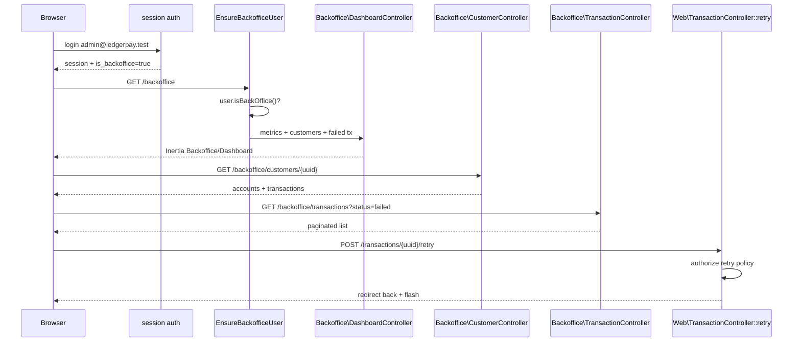

# Commit 8: Backoffice mode

## Контекст

После Commit 7 web-интерфейс работает через Inertia + Vue 3: customer dashboard на `/`, session auth, операции со счетами и транзакциями. Backoffice-пользователь (`customer_id === null`) уже видит **все** accounts/transactions на главной ([`Web\DashboardController`](../app/Http/Controllers/Web/DashboardController.php)), но **нет выделенного операционного UI**: метрик, поиска клиентов, карточки клиента, пагинированного монитора транзакций.

Commit 8 добавляет **изолированный backoffice-раздел** `/backoffice/*` с middleware-защитой. Бизнес-логика не дублируется — только read-only queries + существующий retry endpoint из Commit 7.



## Адаптации под проект

| Черновик коммита | Реальный проект | Решение |
|------------------|-----------------|---------|
| `$user->isBackoffice()` | `User::isBackOffice()` (capital O) | Использовать **`isBackOffice()`** в middleware и контроллерах |
| `Inertia::render(...)` | Web-контроллеры используют **`inertia()`** helper | `return inertia('Backoffice/Dashboard', [...])` |
| `use App\Support\Http\ProblemDetails` в middleware | Не используется | **Не импортировать** — middleware делает `abort(403)` |
| `bootstrap/app.php` — только alias | Уже есть `AddLinkHeadersForPreloadedAssets` | **Добавить** `$middleware->alias([...])`, **сохранить** существующие `web(append:)` и `api(append:)` |
| `DatabaseSeeder` — только BackofficeUserSeeder | Сейчас создаёт `test@example.com` без `customer_id` (тоже backoffice) | **Добавить** `BackofficeUserSeeder`; опционально убрать дублирующий Test User |
| `User::factory()->create(['customer_id' => null])` | Есть state **`backOffice()`** в [`UserFactory`](../database/factories/UserFactory.php) | Использовать `User::factory()->backOffice()->create()` |
| UI на английском | [`AppLayout.vue`](../resources/js/Layouts/AppLayout.vue), [`Dashboard/Index.vue`](../resources/js/Pages/Dashboard/Index.vue) — русский | Ссылку назвать **«Бэк-офис»**; сохранить ссылку «Профиль» |
| `where('name', 'ilike', ...)` | PostgreSQL (`DB_CONNECTION=pgsql`) | **`ilike` корректен** для Sail/pgsql |
| CustomerController: `orWhereIn` без группировки | SQL precedence bug — может вернуть чужие транзакции | Обернуть в `where(function ($q) { ... })` |
| Маршруты `{uuid}` без constraint | [`routes/web.php`](../routes/web.php) использует `->whereUuid('uuid')` | Добавить **`->whereUuid('uuid')`** для customer show |
| Retry из backoffice UI | Уже есть `POST /transactions/{uuid}/retry` | **Переиспользовать** — не создавать backoffice retry route |
| `artisan migrate` в проверке | Commit 8 **без миграций** | Migrate не обязателен; достаточно `db:seed` |
| `HandleInertiaRequests` — добавить `is_backoffice` | Уже шарит `is_backoffice` из Commit 7 | **Не менять** |

---

## Checklist

- [ ] Создать ветку `feature/008-backoffice-dashboard`
- [ ] Middleware `EnsureBackofficeUser` + alias `backoffice` в `bootstrap/app.php`
- [ ] Backoffice controllers: Dashboard, Customer, Transaction
- [ ] Маршруты `/backoffice/*` в `routes/web.php`
- [ ] Ссылка «Бэк-офис» в `AppLayout.vue`
- [ ] Vue pages: `Backoffice/Dashboard`, `CustomerShow`, `Transactions`
- [ ] `BackofficeUserSeeder` + обновить `DatabaseSeeder`
- [ ] `BackofficeAccessTest` (3 кейса)
- [ ] Ручная проверка: login admin → dashboard → customer → transactions → retry
- [ ] `sail artisan test` + `phpstan analyse`

---

## 1. Ветка

```bash
git checkout -b feature/008-backoffice-dashboard
```

---

## 2. Middleware EnsureBackofficeUser

```bash
./vendor/bin/sail artisan make:middleware EnsureBackofficeUser
```

### [`app/Http/Middleware/EnsureBackofficeUser.php`](../app/Http/Middleware/EnsureBackofficeUser.php)

```php
<?php

declare(strict_types=1);

namespace App\Http\Middleware;

use Closure;
use Illuminate\Http\Request;
use Symfony\Component\HttpFoundation\Response;

final class EnsureBackofficeUser
{
    public function handle(Request $request, Closure $next): Response
    {
        $user = $request->user();

        if ($user === null || ! $user->isBackOffice()) {
            abort(403, 'Backoffice access required.');
        }

        return $next($request);
    }
}
```

---

## 3. Регистрация alias в bootstrap/app.php

### [`bootstrap/app.php`](../bootstrap/app.php)

Добавить import:

```php
use App\Http\Middleware\EnsureBackofficeUser;
```

В `withMiddleware` — **добавить alias, не удаляя** `AddLinkHeadersForPreloadedAssets`:

```php
->withMiddleware(function (Middleware $middleware): void {
    $middleware->alias([
        'backoffice' => EnsureBackofficeUser::class,
    ]);

    $middleware->web(append: [
        HandleInertiaRequests::class,
        AddLinkHeadersForPreloadedAssets::class,
    ]);

    $middleware->api(append: [
        RequestIdMiddleware::class,
        ApiRequestLoggingMiddleware::class,
    ]);
})
```

---

## 4. Backoffice Dashboard Controller

```bash
mkdir -p app/Http/Controllers/Web/Backoffice
```

### [`app/Http/Controllers/Web/Backoffice/DashboardController.php`](../app/Http/Controllers/Web/Backoffice/DashboardController.php)

```php
<?php

declare(strict_types=1);

namespace App\Http\Controllers\Web\Backoffice;

use App\Domain\Account\Models\Account;
use App\Domain\Customer\Models\Customer;
use App\Domain\Transaction\Enums\TransactionStatus;
use App\Domain\Transaction\Models\Transaction;
use App\Http\Controllers\Controller;
use Illuminate\Http\Request;
use Inertia\Response;

final class DashboardController extends Controller
{
    public function __invoke(Request $request): Response
    {
        $search = $request->string('search')->toString();

        $customers = Customer::query()
            ->when($search !== '', function ($query) use ($search): void {
                $query->where(function ($query) use ($search): void {
                    $query
                        ->where('name', 'ilike', "%{$search}%")
                        ->orWhere('email', 'ilike', "%{$search}%")
                        ->orWhere('uuid', $search);
                });
            })
            ->withCount('accounts')
            ->latest()
            ->limit(25)
            ->get();

        $failedTransactions = Transaction::query()
            ->with(['sourceAccount.customer', 'targetAccount.customer'])
            ->where('status', TransactionStatus::Failed)
            ->latest()
            ->limit(20)
            ->get();

        return inertia('Backoffice/Dashboard', [
            'filters' => [
                'search' => $search,
            ],
            'metrics' => [
                'customers' => Customer::query()->count(),
                'accounts' => Account::query()->count(),
                'transactions' => Transaction::query()->count(),
                'failed_transactions' => Transaction::query()
                    ->where('status', TransactionStatus::Failed)
                    ->count(),
            ],
            'customers' => $customers->map(fn (Customer $customer) => [
                'uuid' => $customer->uuid,
                'name' => $customer->name,
                'email' => $customer->email,
                'status' => $customer->status->value,
                'accounts_count' => $customer->accounts_count,
                'created_at' => $customer->created_at?->toDateTimeString(),
            ]),
            'failed_transactions' => $failedTransactions->map(fn (Transaction $transaction) => [
                'uuid' => $transaction->uuid,
                'type' => $transaction->type->value,
                'status' => $transaction->status->value,
                'amount' => $transaction->amount,
                'currency' => $transaction->currency,
                'failure_reason' => $transaction->failure_reason,
                'source_customer' => $transaction->sourceAccount?->customer?->email,
                'target_customer' => $transaction->targetAccount?->customer?->email,
                'created_at' => $transaction->created_at?->toDateTimeString(),
            ]),
        ]);
    }
}
```

---

## 5. Backoffice Customer Controller

### [`app/Http/Controllers/Web/Backoffice/CustomerController.php`](../app/Http/Controllers/Web/Backoffice/CustomerController.php)

> **Fix:** группировка `orWhereIn` — иначе query вернёт транзакции других клиентов.

```php
<?php

declare(strict_types=1);

namespace App\Http\Controllers\Web\Backoffice;

use App\Domain\Customer\Models\Customer;
use App\Domain\Transaction\Models\Transaction;
use App\Http\Controllers\Controller;
use Inertia\Response;

final class CustomerController extends Controller
{
    public function show(string $uuid): Response
    {
        $customer = Customer::query()
            ->where('uuid', $uuid)
            ->with('accounts')
            ->firstOrFail();

        $accountIds = $customer->accounts->pluck('id');

        $transactions = Transaction::query()
            ->with(['sourceAccount', 'targetAccount'])
            ->where(function ($query) use ($accountIds): void {
                $query
                    ->whereIn('source_account_id', $accountIds)
                    ->orWhereIn('target_account_id', $accountIds);
            })
            ->latest()
            ->limit(50)
            ->get();

        return inertia('Backoffice/CustomerShow', [
            'customer' => [
                'uuid' => $customer->uuid,
                'name' => $customer->name,
                'email' => $customer->email,
                'status' => $customer->status->value,
                'created_at' => $customer->created_at?->toDateTimeString(),
            ],
            'accounts' => $customer->accounts->map(fn ($account) => [
                'uuid' => $account->uuid,
                'currency' => $account->currency,
                'balance' => $account->balance,
                'status' => $account->status->value,
                'created_at' => $account->created_at?->toDateTimeString(),
            ]),
            'transactions' => $transactions->map(fn (Transaction $transaction) => [
                'uuid' => $transaction->uuid,
                'type' => $transaction->type->value,
                'status' => $transaction->status->value,
                'amount' => $transaction->amount,
                'currency' => $transaction->currency,
                'source_account_uuid' => $transaction->sourceAccount?->uuid,
                'target_account_uuid' => $transaction->targetAccount?->uuid,
                'failure_reason' => $transaction->failure_reason,
                'created_at' => $transaction->created_at?->toDateTimeString(),
            ]),
        ]);
    }
}
```

---

## 6. Backoffice Transaction Monitor Controller

### [`app/Http/Controllers/Web/Backoffice/TransactionController.php`](../app/Http/Controllers/Web/Backoffice/TransactionController.php)

```php
<?php

declare(strict_types=1);

namespace App\Http\Controllers\Web\Backoffice;

use App\Domain\Transaction\Models\Transaction;
use App\Http\Controllers\Controller;
use Illuminate\Http\Request;
use Inertia\Response;

final class TransactionController extends Controller
{
    public function index(Request $request): Response
    {
        $status = $request->string('status')->toString();
        $type = $request->string('type')->toString();

        $transactions = Transaction::query()
            ->with(['sourceAccount.customer', 'targetAccount.customer'])
            ->when($status !== '', fn ($query) => $query->where('status', $status))
            ->when($type !== '', fn ($query) => $query->where('type', $type))
            ->latest()
            ->paginate(50)
            ->through(fn (Transaction $transaction) => [
                'uuid' => $transaction->uuid,
                'type' => $transaction->type->value,
                'status' => $transaction->status->value,
                'amount' => $transaction->amount,
                'currency' => $transaction->currency,
                'source_account_uuid' => $transaction->sourceAccount?->uuid,
                'target_account_uuid' => $transaction->targetAccount?->uuid,
                'source_customer_email' => $transaction->sourceAccount?->customer?->email,
                'target_customer_email' => $transaction->targetAccount?->customer?->email,
                'failure_reason' => $transaction->failure_reason,
                'created_at' => $transaction->created_at?->toDateTimeString(),
            ]);

        return inertia('Backoffice/Transactions', [
            'filters' => [
                'status' => $status,
                'type' => $type,
            ],
            'transactions' => $transactions,
        ]);
    }
}
```

---

## 7. Web routes

### Добавить в [`routes/web.php`](../routes/web.php)

Imports:

```php
use App\Http\Controllers\Web\Backoffice\CustomerController as BackofficeCustomerController;
use App\Http\Controllers\Web\Backoffice\DashboardController as BackofficeDashboardController;
use App\Http\Controllers\Web\Backoffice\TransactionController as BackofficeTransactionController;
```

Внутри `Route::middleware('auth')->group(...)`:

```php
Route::middleware('backoffice')
    ->prefix('backoffice')
    ->name('backoffice.')
    ->group(function (): void {
        Route::get('/', BackofficeDashboardController::class)->name('dashboard');
        Route::get('/customers/{uuid}', [BackofficeCustomerController::class, 'show'])
            ->whereUuid('uuid')
            ->name('customers.show');
        Route::get('/transactions', [BackofficeTransactionController::class, 'index'])
            ->name('transactions.index');
    });
```

> Retry остаётся на существующем `POST /transactions/{uuid}/retry` — backoffice UI вызывает его напрямую; [`TransactionPolicy::retry`](../app/Policies/TransactionPolicy.php) уже разрешает backoffice.

---

## 8. AppLayout — ссылка в header

### [`resources/js/Layouts/AppLayout.vue`](../resources/js/Layouts/AppLayout.vue)

Добавить ссылку **перед** email, сохранив «Профиль»:

```vue
<div class="flex items-center gap-4 text-sm">
    <Link
        v-if="page.props.auth.user?.is_backoffice"
        href="/backoffice"
        class="text-indigo-400 hover:text-indigo-300"
    >
        Бэк-офис
    </Link>

    <span v-if="page.props.auth.user" class="text-gray-300">
        {{ page.props.auth.user.email }}
    </span>

    <Link
        :href="route('profile.edit')"
        class="text-indigo-400 hover:text-indigo-300"
    >
        Профиль
    </Link>

    <button class="btn-secondary" @click="logout">
        Выйти
    </button>
</div>
```

---

## 9. Vue Pages

```bash
mkdir -p resources/js/Pages/Backoffice
```

| Файл | Назначение |
|------|------------|
| [`Backoffice/Dashboard.vue`](../resources/js/Pages/Backoffice/Dashboard.vue) | Метрики, поиск клиентов, failed transactions + retry |
| [`Backoffice/CustomerShow.vue`](../resources/js/Pages/Backoffice/CustomerShow.vue) | Карточка клиента, счета, транзакции |
| [`Backoffice/Transactions.vue`](../resources/js/Pages/Backoffice/Transactions.vue) | Фильтры status/type, paginated monitor + retry |

> Стиль как в Commit 7: `defineOptions({ layout, name })`, Ziggy `route()`, русские подписи, `<style scoped>`.

### [`resources/js/Pages/Backoffice/Dashboard.vue`](../resources/js/Pages/Backoffice/Dashboard.vue)

```vue
<script setup>
import {Link, router, useForm} from '@inertiajs/vue3';
import AppLayout from '@/Layouts/AppLayout.vue';

defineOptions({
    layout: AppLayout,
    name  : 'BackofficeDashboard',
})

const props = defineProps({
    filters            : Object,
    metrics            : Object,
    customers          : Array,
    failed_transactions: Array,
})

const searchForm = useForm({
    search: props.filters.search ?? '',
})

function submitSearch() {
    router.get(route('backoffice.dashboard'), {
        search: searchForm.search,
    }, {
        preserveState: true,
        replace      : true,
    })
}

function money(amount, currency) {
    return `${(amount / 100).toFixed(2)} ${currency}`
}

</script>

<template>
    <div class="space-y-8">
        <section>
            <h1 class="text-3xl font-bold">Бэк-офис</h1>
            <p class="mt-2 text-gray-400">
                Операционный мониторинг клиентов, счетов и неудачных транзакций.
            </p>
        </section>

        <section class="grid gap-6 lg:grid-cols-4">
            <div class="card">
                <div class="text-sm text-gray-400">Клиенты</div>
                <div class="mt-2 text-3xl font-bold">{{ metrics.customers }}</div>
            </div>

            <div class="card">
                <div class="text-sm text-gray-400">Счета</div>
                <div class="mt-2 text-3xl font-bold">{{ metrics.accounts }}</div>
            </div>

            <div class="card">
                <div class="text-sm text-gray-400">Транзакции</div>
                <div class="mt-2 text-3xl font-bold">{{ metrics.transactions }}</div>
            </div>

            <div class="card">
                <div class="text-sm text-gray-400">Ошибки</div>
                <div class="mt-2 text-3xl font-bold text-red-300">
                    {{ metrics.failed_transactions }}
                </div>
            </div>
        </section>

        <section class="card">
            <div class="mb-4 flex items-center justify-between gap-4">
                <h2 class="text-xl font-bold">Поиск клиентов</h2>

                <Link :href="route('backoffice.transactions.index')" class="text-indigo-400 hover:text-indigo-300">
                    Монитор транзакций →
                </Link>
            </div>

            <form class="mb-6 flex gap-3" @submit.prevent="submitSearch">
                <input
                    v-model="searchForm.search"
                    class="input"
                    placeholder="Поиск по имени, email или UUID"
                >

                <button class="btn" :disabled="searchForm.processing">
                    Найти
                </button>
            </form>

            <div class="overflow-x-auto">
                <table class="w-full text-left text-sm">
                    <thead class="text-gray-400">
                    <tr>
                        <th class="py-2">Клиент</th>
                        <th>Email</th>
                        <th>Статус</th>
                        <th>Счета</th>
                        <th>Создан</th>
                        <th></th>
                    </tr>
                    </thead>

                    <tbody>
                    <tr
                        v-for="customer in customers"
                        :key="customer.uuid"
                        class="border-t border-gray-800"
                    >
                        <td class="py-3">
                            <div class="font-semibold">{{ customer.name }}</div>
                            <div class="font-mono text-xs text-gray-500">{{ customer.uuid }}</div>
                        </td>
                        <td>{{ customer.email }}</td>
                        <td>{{ customer.status }}</td>
                        <td>{{ customer.accounts_count }}</td>
                        <td>{{ customer.created_at }}</td>
                        <td>
                            <Link
                                :href="route('backoffice.customers.show', customer.uuid)"
                                class="text-indigo-400 hover:text-indigo-300"
                            >
                                Открыть
                            </Link>
                        </td>
                    </tr>

                    <tr v-if="customers.length === 0">
                        <td colspan="6" class="py-6 text-center text-gray-500">
                            Клиенты не найдены.
                        </td>
                    </tr>
                    </tbody>
                </table>
            </div>
        </section>

        <section class="card">
            <h2 class="mb-4 text-xl font-bold">Неудачные транзакции</h2>

            <div class="overflow-x-auto">
                <table class="w-full text-left text-sm">
                    <thead class="text-gray-400">
                    <tr>
                        <th class="py-2">UUID</th>
                        <th>Тип</th>
                        <th>Сумма</th>
                        <th>Клиент</th>
                        <th>Причина</th>
                        <th>Создана</th>
                        <th></th>
                    </tr>
                    </thead>

                    <tbody>
                    <tr
                        v-for="transaction in failed_transactions"
                        :key="transaction.uuid"
                        class="border-t border-gray-800"
                    >
                        <td class="py-3 font-mono text-xs">{{ transaction.uuid }}</td>
                        <td>{{ transaction.type }}</td>
                        <td>{{ money(transaction.amount, transaction.currency) }}</td>
                        <td>
                            {{ transaction.source_customer ?? transaction.target_customer ?? '—' }}
                        </td>
                        <td class="max-w-md text-red-300">{{ transaction.failure_reason ?? '—' }}</td>
                        <td>{{ transaction.created_at }}</td>
                        <td>
                            <form @submit.prevent="$inertia.post(route('transactions.retry', transaction.uuid))">
                                <button class="text-indigo-400 hover:text-indigo-300">
                                    Повторить
                                </button>
                            </form>
                        </td>
                    </tr>

                    <tr v-if="failed_transactions.length === 0">
                        <td colspan="7" class="py-6 text-center text-gray-500">
                            Нет неудачных транзакций.
                        </td>
                    </tr>
                    </tbody>
                </table>
            </div>
        </section>
    </div>
</template>

<style scoped>

</style>
```

### [`resources/js/Pages/Backoffice/CustomerShow.vue`](../resources/js/Pages/Backoffice/CustomerShow.vue)

```vue
<script setup>
import {Link} from '@inertiajs/vue3';
import AppLayout from '@/Layouts/AppLayout.vue';

defineOptions({
    layout: AppLayout,
    name  : 'BackofficeCustomerShow',
})

defineProps({
    customer    : Object,
    accounts    : Array,
    transactions: Array,
})

function money(amount, currency) {
    return `${(amount / 100).toFixed(2)} ${currency}`
}

</script>

<template>
    <div class="space-y-8">
        <section>
            <Link :href="route('backoffice.dashboard')" class="text-indigo-400 hover:text-indigo-300">
                ← Бэк-офис
            </Link>

            <h1 class="mt-4 text-3xl font-bold">{{ customer.name }}</h1>
            <p class="mt-2 text-gray-400">{{ customer.email }}</p>
            <p class="mt-1 font-mono text-xs text-gray-500">{{ customer.uuid }}</p>
        </section>

        <section class="grid gap-6 lg:grid-cols-3">
            <div class="card">
                <div class="text-sm text-gray-400">Статус</div>
                <div class="mt-2 text-2xl font-bold">{{ customer.status }}</div>
            </div>

            <div class="card">
                <div class="text-sm text-gray-400">Счета</div>
                <div class="mt-2 text-2xl font-bold">{{ accounts.length }}</div>
            </div>

            <div class="card">
                <div class="text-sm text-gray-400">Создан</div>
                <div class="mt-2 text-lg font-semibold">{{ customer.created_at }}</div>
            </div>
        </section>

        <section class="card">
            <h2 class="mb-4 text-xl font-bold">Счета</h2>

            <div class="overflow-x-auto">
                <table class="w-full text-left text-sm">
                    <thead class="text-gray-400">
                    <tr>
                        <th class="py-2">UUID</th>
                        <th>Валюта</th>
                        <th>Баланс</th>
                        <th>Статус</th>
                        <th>Создан</th>
                        <th></th>
                    </tr>
                    </thead>

                    <tbody>
                    <tr v-for="account in accounts" :key="account.uuid" class="border-t border-gray-800">
                        <td class="py-3 font-mono text-xs">{{ account.uuid }}</td>
                        <td>{{ account.currency }}</td>
                        <td>{{ money(account.balance, account.currency) }}</td>
                        <td>{{ account.status }}</td>
                        <td>{{ account.created_at }}</td>
                        <td>
                            <Link
                                :href="route('accounts.ledger', account.uuid)"
                                class="text-indigo-400 hover:text-indigo-300"
                            >
                                История операций
                            </Link>
                        </td>
                    </tr>

                    <tr v-if="accounts.length === 0">
                        <td colspan="6" class="py-6 text-center text-gray-500">
                            У клиента нет счетов.
                        </td>
                    </tr>
                    </tbody>
                </table>
            </div>
        </section>

        <section class="card">
            <h2 class="mb-4 text-xl font-bold">Последние транзакции клиента</h2>

            <div class="overflow-x-auto">
                <table class="w-full text-left text-sm">
                    <thead class="text-gray-400">
                    <tr>
                        <th class="py-2">UUID</th>
                        <th>Тип</th>
                        <th>Статус</th>
                        <th>Сумма</th>
                        <th>Источник</th>
                        <th>Назначение</th>
                        <th>Создана</th>
                    </tr>
                    </thead>

                    <tbody>
                    <tr v-for="transaction in transactions" :key="transaction.uuid" class="border-t border-gray-800">
                        <td class="py-3 font-mono text-xs">{{ transaction.uuid }}</td>
                        <td>{{ transaction.type }}</td>
                        <td>
                                <span
                                    class="rounded-full px-2 py-1 text-xs"
                                    :class="{
                                        'bg-green-950 text-green-300': transaction.status === 'completed',
                                        'bg-yellow-950 text-yellow-300': transaction.status === 'pending' || transaction.status === 'processing',
                                        'bg-red-950 text-red-300': transaction.status === 'failed',
                                    }"
                                >
                                    {{ transaction.status }}
                                </span>
                        </td>
                        <td>{{ money(transaction.amount, transaction.currency) }}</td>
                        <td class="font-mono text-xs">{{ transaction.source_account_uuid ?? '—' }}</td>
                        <td class="font-mono text-xs">{{ transaction.target_account_uuid ?? '—' }}</td>
                        <td>{{ transaction.created_at }}</td>
                    </tr>

                    <tr v-if="transactions.length === 0">
                        <td colspan="7" class="py-6 text-center text-gray-500">
                            Транзакций пока нет.
                        </td>
                    </tr>
                    </tbody>
                </table>
            </div>
        </section>
    </div>
</template>

<style scoped>

</style>
```

### [`resources/js/Pages/Backoffice/Transactions.vue`](../resources/js/Pages/Backoffice/Transactions.vue)

```vue
<script setup>
import {Link, router, useForm} from '@inertiajs/vue3';
import AppLayout from '@/Layouts/AppLayout.vue';

defineOptions({
    layout: AppLayout,
    name  : 'BackofficeTransactions',
})

const props = defineProps({
    filters     : Object,
    transactions: Object,
})

const filterForm = useForm({
    status: props.filters.status ?? '',
    type  : props.filters.type ?? '',
})

function applyFilters() {
    router.get(route('backoffice.transactions.index'), {
        status: filterForm.status,
        type  : filterForm.type,
    }, {
        preserveState: true,
        replace      : true,
    })
}

function money(amount, currency) {
    return `${(amount / 100).toFixed(2)} ${currency}`
}

</script>

<template>
    <div class="space-y-8">
        <section>
            <Link :href="route('backoffice.dashboard')" class="text-indigo-400 hover:text-indigo-300">
                ← Бэк-офис
            </Link>

            <h1 class="mt-4 text-3xl font-bold">Монитор транзакций</h1>
            <p class="mt-2 text-gray-400">
                Просмотр транзакций на уровне бэк-офиса.
            </p>
        </section>

        <section class="card">
            <form class="grid gap-4 md:grid-cols-3" @submit.prevent="applyFilters">
                <div>
                    <label class="label">Статус</label>
                    <select v-model="filterForm.status" class="input">
                        <option value="">Все</option>
                        <option value="pending">pending</option>
                        <option value="processing">processing</option>
                        <option value="completed">completed</option>
                        <option value="failed">failed</option>
                        <option value="cancelled">cancelled</option>
                    </select>
                </div>

                <div>
                    <label class="label">Тип</label>
                    <select v-model="filterForm.type" class="input">
                        <option value="">Все</option>
                        <option value="deposit">deposit</option>
                        <option value="withdrawal">withdrawal</option>
                        <option value="transfer">transfer</option>
                    </select>
                </div>

                <div class="flex items-end">
                    <button class="btn" :disabled="filterForm.processing">
                        Применить
                    </button>
                </div>
            </form>
        </section>

        <section class="card">
            <div class="overflow-x-auto">
                <table class="w-full text-left text-sm">
                    <thead class="text-gray-400">
                    <tr>
                        <th class="py-2">UUID</th>
                        <th>Тип</th>
                        <th>Статус</th>
                        <th>Сумма</th>
                        <th>Клиент</th>
                        <th>Причина</th>
                        <th>Создана</th>
                        <th></th>
                    </tr>
                    </thead>

                    <tbody>
                    <tr v-for="transaction in transactions.data" :key="transaction.uuid" class="border-t border-gray-800">
                        <td class="py-3 font-mono text-xs">{{ transaction.uuid }}</td>
                        <td>{{ transaction.type }}</td>
                        <td>
                                <span
                                    class="rounded-full px-2 py-1 text-xs"
                                    :class="{
                                        'bg-green-950 text-green-300': transaction.status === 'completed',
                                        'bg-yellow-950 text-yellow-300': transaction.status === 'pending' || transaction.status === 'processing',
                                        'bg-red-950 text-red-300': transaction.status === 'failed',
                                    }"
                                >
                                    {{ transaction.status }}
                                </span>
                        </td>
                        <td>{{ money(transaction.amount, transaction.currency) }}</td>
                        <td>
                            {{ transaction.source_customer_email ?? transaction.target_customer_email ?? '—' }}
                        </td>
                        <td class="max-w-md text-red-300">
                            {{ transaction.failure_reason ?? '—' }}
                        </td>
                        <td>{{ transaction.created_at }}</td>
                        <td>
                            <form
                                v-if="transaction.status === 'failed'"
                                @submit.prevent="$inertia.post(route('transactions.retry', transaction.uuid))"
                            >
                                <button class="text-indigo-400 hover:text-indigo-300">
                                    Повторить
                                </button>
                            </form>
                        </td>
                    </tr>

                    <tr v-if="transactions.data.length === 0">
                        <td colspan="8" class="py-6 text-center text-gray-500">
                            Транзакции не найдены.
                        </td>
                    </tr>
                    </tbody>
                </table>
            </div>

            <div v-if="transactions.links?.length > 3" class="mt-6 flex flex-wrap gap-2">
                <Link
                    v-for="link in transactions.links"
                    :key="link.label"
                    :href="link.url"
                    class="rounded-lg px-3 py-1 text-sm"
                    :class="link.active
                        ? 'bg-indigo-600 text-white'
                        : link.url
                            ? 'bg-gray-800 text-gray-200 hover:bg-gray-700'
                            : 'cursor-not-allowed bg-gray-900 text-gray-600'"
                    :preserve-state="true"
                    v-html="link.label"
                />
            </div>
        </section>
    </div>
</template>

<style scoped>

</style>
```

---

## 10. BackofficeUserSeeder

```bash
./vendor/bin/sail artisan make:seeder BackofficeUserSeeder
```

### [`database/seeders/BackofficeUserSeeder.php`](../database/seeders/BackofficeUserSeeder.php)

```php
<?php

declare(strict_types=1);

namespace Database\Seeders;

use App\Models\User;
use Illuminate\Database\Seeder;

final class BackofficeUserSeeder extends Seeder
{
    public function run(): void
    {
        User::query()->updateOrCreate(
            ['email' => 'admin@ledgerpay.test'],
            [
                'customer_id' => null,
                'name' => 'Backoffice Admin',
                'password' => 'StrongPassword123!',
            ],
        );
    }
}
```

### [`database/seeders/DatabaseSeeder.php`](../database/seeders/DatabaseSeeder.php)

```php
public function run(): void
{
    $this->call([
        BackofficeUserSeeder::class,
    ]);
}
```

> Опционально: убрать `User::factory()->create(['email' => 'test@example.com'])` — он тоже backoffice (`customer_id` null по умолчанию) и может путать при ручной проверке.

Запуск:

```bash
./vendor/bin/sail artisan db:seed
```

Логин: `admin@ledgerpay.test` / `StrongPassword123!`

---

## 11. Feature tests

```bash
./vendor/bin/sail artisan make:test BackofficeAccessTest
```

### [`tests/Feature/BackofficeAccessTest.php`](../tests/Feature/BackofficeAccessTest.php)

```php
<?php

declare(strict_types=1);

namespace Tests\Feature;

use App\Domain\Customer\Models\Customer;
use App\Models\User;
use Illuminate\Foundation\Testing\RefreshDatabase;
use Tests\TestCase;

final class BackofficeAccessTest extends TestCase
{
    use RefreshDatabase;

    public function test_backoffice_user_can_open_backoffice_dashboard(): void
    {
        $user = User::factory()->backOffice()->create();

        $this->actingAs($user);

        $this->get('/backoffice')
            ->assertOk();
    }

    public function test_customer_user_cannot_open_backoffice_dashboard(): void
    {
        $customer = Customer::factory()->create();

        $user = User::factory()->forCustomer($customer)->create();

        $this->actingAs($user);

        $this->get('/backoffice')
            ->assertForbidden();
    }

    public function test_guest_is_redirected_from_backoffice_dashboard(): void
    {
        $this->get('/backoffice')
            ->assertRedirect(route('login'));
    }
}
```

---

## 12. Ручная проверка

```bash
# Terminal 1
./vendor/bin/sail npm run dev

# Terminal 2
./vendor/bin/sail artisan queue:work redis --queue=transactions,default

# Terminal 3
./vendor/bin/sail artisan db:seed
```

1. Открыть `http://localhost/login`
2. Войти: `admin@ledgerpay.test` / `StrongPassword123!`
3. В header появилась ссылка «Бэк-офис»
4. `/backoffice` — метрики, поиск клиентов, failed transactions
5. Открыть клиента → accounts + transactions
6. `/backoffice/transactions` — фильтры, pagination
7. Retry failed transaction → queue worker обрабатывает
8. Logout → login как customer → `/backoffice` → **403**

---

## 13. Верификация

```bash
./vendor/bin/sail artisan test
./vendor/bin/sail php vendor/bin/phpstan analyse
```

---

## 14. Commit

```bash
git add .
git commit -m "$(cat <<'EOF'
feat: add backoffice dashboard and transaction monitoring

EOF
)"
```

Расширенное описание (опционально):

```
Задача: добавить операционный backoffice UI для мониторинга клиентов и транзакций

- HTTP: middleware EnsureBackofficeUser + alias backoffice — доступ только для User::isBackOffice();

- HTTP: Backoffice controllers (Dashboard, Customer, Transaction) — read-only queries, inertia pages;

- HTTP: маршруты /backoffice/* внутри auth + backoffice middleware; retry переиспользует POST /transactions/{uuid}/retry;

- HTTP: TransactionResource для списка транзакций backoffice;

- Frontend: Backoffice/Dashboard — метрики, поиск клиентов (ilike), failed transactions с retry;

- Frontend: Backoffice/CustomerShow — карточка клиента, accounts, transactions, ссылка на ledger;

- Frontend: Backoffice/Transactions — фильтры status/type, paginated monitor;

- Frontend: ссылка «Бэк-офис» в AppLayout для is_backoffice пользователей;

- Database: BackofficeUserSeeder — admin@ledgerpay.test для ручной проверки;

- Tests: BackofficeAccessTest — backoffice ok, customer 403, guest redirect login.
```

---

## Файлы: сводка

**Создать (~9):**

- `app/Http/Middleware/EnsureBackofficeUser.php`
- `app/Http/Controllers/Web/Backoffice/DashboardController.php`
- `app/Http/Controllers/Web/Backoffice/CustomerController.php`
- `app/Http/Controllers/Web/Backoffice/TransactionController.php`
- `resources/js/Pages/Backoffice/Dashboard.vue`
- `resources/js/Pages/Backoffice/CustomerShow.vue`
- `resources/js/Pages/Backoffice/Transactions.vue`
- `database/seeders/BackofficeUserSeeder.php`
- `tests/Feature/BackofficeAccessTest.php`

**Изменить (~4):**

- `bootstrap/app.php` — alias `backoffice`
- `routes/web.php` — backoffice route group
- `resources/js/Layouts/AppLayout.vue` — ссылка «Бэк-офис»
- `database/seeders/DatabaseSeeder.php`

**Не трогать:**

- Application Services, Policies (уже поддерживают backoffice)
- `HandleInertiaRequests` (is_backoffice уже есть из Commit 7)
- Customer dashboard `/` (остаётся для backoffice как общий view)
- API routes
- Миграции

**Следующий этап:** Commit 9 — audit log: actor, action, entity, metadata, immutable audit trail, API/web activity tracking.
