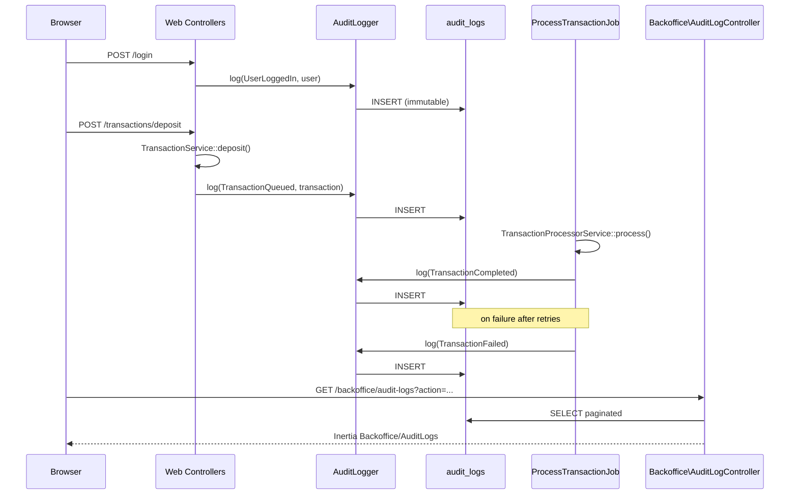

# Commit 9: Immutable audit log

## Контекст

После Commit 8 есть backoffice UI (`/backoffice/*`), session auth, операции со счетами и транзакциями через web + queue worker. **Нет централизованного audit trail**: кто что сделал, над какой сущностью, с каким request context — не сохраняется.

Commit 9 добавляет **immutable audit log**: таблица `audit_logs`, DDD-структура `Domain/Audit`, сервис `AuditLogger`, инструментация auth/account/transactions/job, backoffice-страница просмотра с фильтрами.



## Адаптации под проект

| Черновик коммита | Реальный проект | Решение |
|------------------|-----------------|---------|
| `Inertia::render(...)` | Web-контроллеры используют **`inertia()`** helper | `return inertia('Backoffice/AuditLogs', [...])` |
| `TransactionProcessor` | [`TransactionProcessorService`](../app/Application/Transaction/Services/TransactionProcessorService.php) | DI: **`TransactionProcessorService $processor`** |
| `Auth::attempt` в login | [`LoginRequest::authenticate()`](../app/Http/Requests/Auth/LoginRequest.php) с rate limiting | **Сохранить** `$request->authenticate()`; audit **после** `session()->regenerate()` |
| `route('login.page')` | Breeze: **`route('login')`** | Logout redirect → **`route('login')`** |
| `CreateAccountData(customerId:)` | [`CreateAccountData(customerUuid:)`](../app/Application/Account/DTO/CreateAccountData.php) | `$account = $service->create(new CreateAccountData($customer->uuid, ...))` |
| `AccountController::store` не сохраняет account | `AccountService::create()` **возвращает** `Account` | Захватить **`$account = $accountService->create(...)`** |
| `$user->isBackoffice()` | `User::isBackOffice()` (capital O) | **`isBackOffice()`** |
| Inline idempotency `Str::uuid()` | Web requests: **`$request->idempotencyKey()`** | **Не менять** — сохранить существующий паттерн |
| `TransactionController` игнорирует return | `deposit/withdraw/transfer/retry` **возвращают** `Transaction` | `$transaction = $service->...()` для audit |
| UI на английском | Backoffice pages — **русский** ([`Dashboard.vue`](../resources/js/Pages/Backoffice/Dashboard.vue)) | Локализовать `AuditLogs.vue`; ссылка **«Журнал аудита →»** |
| Hardcoded `/backoffice/audit-logs` | Ziggy + `route()` | **`route('backoffice.audit-logs.index')`** |
| `User::factory()->create(['customer_id' => null])` | Есть state **`backOffice()`** | `User::factory()->backOffice()->create()` |
| `User::factory()->create(['customer_id' => $id])` | Есть **`forCustomer($customer)`** | Использовать в тестах |
| `$request->headers->get('X-Request-Id')` | [`RequestIdMiddleware`](../app/Http/Middleware/RequestIdMiddleware.php) только на **API** stack | Web audit: `request_id` будет **null** (нормально). Опционально: добавить middleware в web stack |
| `entity_uuid` из `$entity->uuid` | [`User`](../app/Models/User.php) **без uuid** | Для User auth-событий: `entity_id` = user id, `entity_uuid` = null |
| `jsonb` в migration | PostgreSQL (`DB_CONNECTION=pgsql`), jsonb ещё не использовался | **`jsonb` корректен** для pgsql |
| `AuditAction::TransactionCreated` | Не логируется в этом коммите | Enum оставить; логируется **`TransactionQueued`** |
| `BackofficeCustomerViewed`, `BackofficeDashboardViewed` | Не используются | Зарезервированы; **не добавлять** в этом коммите |
| `ProcessTransactionJob::failed()` | Сейчас: log → update | Добавить audit **после** update (как в черновике) |
| `AuthController::register` | Positional DTO, `$request->validated()` | Сохранить стиль проекта; добавить только audit DI |

---

## Checklist

- [ ] Создать ветку `feature/009-audit-log`
- [ ] DDD-структура: `Domain/Audit/{Models,Enums}`, `Application/Audit/Services`
- [ ] `AuditAction` enum + migration `audit_logs` + `AuditLog` model (immutable)
- [ ] `AuditLogger` service
- [ ] Инструментация: `AuthController`, `AccountController`, `TransactionController`
- [ ] Инструментация: `ProcessTransactionJob` (completed + failed)
- [ ] `Backoffice\AuditLogController` + route + Vue page
- [ ] Ссылка «Журнал аудита →» в `Backoffice/Dashboard.vue`
- [ ] `AuditLogTest` (5 кейсов)
- [ ] `sail artisan migrate` + `sail artisan test` + `npm run build`
- [ ] Ручная проверка: login → deposit → audit page

---

## 1. Ветка

```bash
git checkout -b feature/009-audit-log
```

---

## 2. DDD-структура Audit

```bash
mkdir -p app/Domain/Audit/Models
mkdir -p app/Domain/Audit/Enums
mkdir -p app/Application/Audit/Services
```

> `app/Http/Controllers/Web/Backoffice/` уже существует после Commit 8.

---

## 3. Enum AuditAction

### [`app/Domain/Audit/Enums/AuditAction.php`](../app/Domain/Audit/Enums/AuditAction.php)

```php
<?php

declare(strict_types=1);

namespace App\Domain\Audit\Enums;

enum AuditAction: string
{
    case UserRegistered = 'user_registered';
    case UserLoggedIn = 'user_logged_in';
    case UserLoggedOut = 'user_logged_out';

    case AccountCreated = 'account_created';

    case TransactionCreated = 'transaction_created';
    case TransactionQueued = 'transaction_queued';
    case TransactionCompleted = 'transaction_completed';
    case TransactionFailed = 'transaction_failed';
    case TransactionRetried = 'transaction_retried';

    case BackofficeCustomerViewed = 'backoffice_customer_viewed';
    case BackofficeDashboardViewed = 'backoffice_dashboard_viewed';
}
```

---

## 4. Migration

```bash
./vendor/bin/sail artisan make:migration create_audit_logs_table
```

### [`database/migrations/xxxx_xx_xx_xxxxxx_create_audit_logs_table.php`](../database/migrations/)

```php
<?php

declare(strict_types=1);

use Illuminate\Database\Migrations\Migration;
use Illuminate\Database\Schema\Blueprint;
use Illuminate\Support\Facades\Schema;

return new class extends Migration
{
    public function up(): void
    {
        Schema::create('audit_logs', function (Blueprint $table): void {
            $table->id();

            $table->foreignId('actor_user_id')
                ->nullable()
                ->constrained('users')
                ->nullOnDelete();

            $table->string('action');

            $table->string('entity_type')->nullable();
            $table->unsignedBigInteger('entity_id')->nullable();
            $table->uuid('entity_uuid')->nullable();

            $table->jsonb('metadata')->nullable();

            $table->string('request_id')->nullable();
            $table->ipAddress('ip_address')->nullable();
            $table->string('user_agent')->nullable();

            $table->timestamps();

            $table->index(['actor_user_id', 'created_at']);
            $table->index(['action', 'created_at']);
            $table->index(['entity_type', 'entity_id']);
            $table->index('entity_uuid');
            $table->index('request_id');
        });
    }

    public function down(): void
    {
        Schema::dropIfExists('audit_logs');
    }
};
```

---

## 5. Model AuditLog (immutable)

### [`app/Domain/Audit/Models/AuditLog.php`](../app/Domain/Audit/Models/AuditLog.php)

```php
<?php

declare(strict_types=1);

namespace App\Domain\Audit\Models;

use App\Domain\Audit\Enums\AuditAction;
use App\Models\User;
use Illuminate\Database\Eloquent\Model;
use Illuminate\Database\Eloquent\Relations\BelongsTo;
use LogicException;

final class AuditLog extends Model
{
    protected $fillable = [
        'actor_user_id',
        'action',
        'entity_type',
        'entity_id',
        'entity_uuid',
        'metadata',
        'request_id',
        'ip_address',
        'user_agent',
    ];

    protected function casts(): array
    {
        return [
            'action'   => AuditAction::class,
            'metadata' => 'array',
        ];
    }

    protected static function booted(): void
    {
        static::updating(function (): never {
            throw new LogicException('Audit logs are immutable.');
        });

        static::deleting(function (): never {
            throw new LogicException('Audit logs are immutable.');
        });
    }

    public function actor(): BelongsTo
    {
        return $this->belongsTo(User::class, 'actor_user_id');
    }
}
```

---

## 6. AuditLogger service

### [`app/Application/Audit/Services/AuditLogger.php`](../app/Application/Audit/Services/AuditLogger.php)

```php
<?php

declare(strict_types=1);

namespace App\Application\Audit\Services;

use App\Domain\Audit\Enums\AuditAction;
use App\Domain\Audit\Models\AuditLog;
use Illuminate\Database\Eloquent\Model;
use Illuminate\Http\Request;
use Illuminate\Support\Facades\Auth;

final class AuditLogger
{
    public function log(
        AuditAction $action,
        ?Model $entity = null,
        array $metadata = [],
        ?Request $request = null,
        ?int $actorUserId = null,
    ): AuditLog {
        $actorUserId ??= Auth::id();

        return AuditLog::query()->create([
            'actor_user_id' => $actorUserId,
            'action'        => $action,
            'entity_type'   => $entity ? $entity::class : null,
            'entity_id'     => $entity?->getKey(),
            'entity_uuid'   => $entity?->uuid ?? null,
            'metadata'      => $metadata === [] ? null : $metadata,
            'request_id'    => $request?->headers->get('X-Request-Id'),
            'ip_address'    => $request?->ip(),
            'user_agent'    => $request?->userAgent(),
        ]);
    }
}
```

> Laravel auto-resolves `AuditLogger` через DI — регистрация в ServiceProvider не нужна.

---

## 7. AuthController — audit login/register/logout

### Изменить [`app/Http/Controllers/Web/AuthController.php`](../app/Http/Controllers/Web/AuthController.php)

Imports:

```php
use App\Application\Audit\Services\AuditLogger;
use App\Domain\Audit\Enums\AuditAction;
```

**login** — сохранить `authenticate()`, добавить audit:

```php
public function login(LoginRequest $request, AuditLogger $audit): RedirectResponse
{
    $request->authenticate();
    $request->session()->regenerate();

    $audit->log(
        action: AuditAction::UserLoggedIn,
        entity: $request->user(),
        request: $request,
    );

    return redirect()->route('dashboard');
}
```

**register**:

```php
public function register(
    RegisterRequest $request,
    AuthService $authService,
    AuditLogger $audit,
): RedirectResponse {
    $validated = $request->validated();
    $result = $authService->registerCustomer(
        new RegisterCustomerUserData(
            $validated['name'],
            $validated['email'],
            $validated['password'],
        )
    );

    Auth::login($result['user']);
    $request->session()->regenerate();

    $audit->log(
        action: AuditAction::UserRegistered,
        entity: $result['user'],
        metadata: [
            'customer_uuid' => $result['customer']->uuid,
        ],
        request: $request,
    );

    return redirect()->route('dashboard');
}
```

**logout** — audit **до** `Auth::logout()`:

```php
public function logout(AuditLogger $audit): RedirectResponse
{
    $user = request()->user();

    if ($user !== null) {
        $audit->log(
            action: AuditAction::UserLoggedOut,
            entity: $user,
            request: request(),
        );
    }

    Auth::logout();
    request()->session()->invalidate();
    request()->session()->regenerateToken();

    return redirect()->route('login');
}
```

---

## 8. AccountController — audit account creation

### Изменить [`app/Http/Controllers/Web/AccountController.php`](../app/Http/Controllers/Web/AccountController.php)

Imports + обновить `store()`:

```php
use App\Application\Audit\Services\AuditLogger;
use App\Domain\Audit\Enums\AuditAction;

public function store(
    StoreAccountRequest $request,
    AccountService $accountService,
    AuditLogger $audit,
): RedirectResponse {
    $this->authorize('create', Account::class);

    $user = $request->user();
    $validated = $request->validated();

    $customer = $user->isBackOffice()
        ? Customer::query()->where('uuid', $validated['customer_uuid'])->firstOrFail()
        : $user->customer;

    $account = $accountService->create(
        new CreateAccountData(
            $customer->uuid,
            $validated['currency'],
        )
    );

    $audit->log(
        action: AuditAction::AccountCreated,
        entity: $account,
        metadata: [
            'customer_uuid' => $customer->uuid,
            'currency'      => $account->currency,
        ],
        request: $request,
    );

    return back()->with('success', 'Банковский счет создан.');
}
```

---

## 9. TransactionController — audit queued/retry

### Изменить [`app/Http/Controllers/Web/TransactionController.php`](../app/Http/Controllers/Web/TransactionController.php)

Imports:

```php
use App\Application\Audit\Services\AuditLogger;
use App\Domain\Audit\Enums\AuditAction;
```

Паттерн для **deposit / withdraw / transfer** (validation + authorize без изменений):

```php
$transaction = $transactionService->deposit(/* ... existing DTO ... */);

$audit->log(
    action: AuditAction::TransactionQueued,
    entity: $transaction,
    metadata: [
        'type'     => $transaction->type->value,
        'amount'   => $transaction->amount,
        'currency' => $transaction->currency,
    ],
    request: $request,
);
```

**retry**:

```php
public function retry(
    string $uuid,
    TransactionService $transactionService,
    AuditLogger $audit,
): RedirectResponse {
    $transaction = Transaction::query()
        ->with(['sourceAccount', 'targetAccount'])
        ->where('uuid', $uuid)
        ->firstOrFail();

    $this->authorize('retry', $transaction);

    $retried = $transactionService->retry($uuid);

    $audit->log(
        action: AuditAction::TransactionRetried,
        entity: $retried,
        request: request(),
    );

    return back()->with('success', 'Транзакция повторной попытки поставлена в очередь.');
}
```

---

## 10. ProcessTransactionJob — audit completed/failed

### Изменить [`app/Application/Transaction/Jobs/ProcessTransactionJob.php`](../app/Application/Transaction/Jobs/ProcessTransactionJob.php)

Imports:

```php
use App\Application\Audit\Services\AuditLogger;
use App\Domain\Audit\Enums\AuditAction;
```

**handle**:

```php
public function handle(
    TransactionProcessorService $processor,
    AuditLogger $audit,
): void {
    // ... existing load + idempotency checks ...

    $processed = $processor->process($transaction);

    $audit->log(
        action: AuditAction::TransactionCompleted,
        entity: $processed,
        metadata: [
            'type'     => $processed->type->value,
            'amount'   => $processed->amount,
            'currency' => $processed->currency,
        ],
    );

    Log::info('Transaction processing completed.', [
        'transaction_id' => $this->transactionId,
    ]);
}
```

**failed** — update status, затем audit (без Request — job context):

```php
public function failed(Throwable $exception): void
{
    $transaction = Transaction::query()->find($this->transactionId);

    if (!$transaction instanceof Transaction) {
        return;
    }

    $transaction->update([
        'status'         => TransactionStatus::Failed,
        'failure_reason' => $exception->getMessage(),
    ]);

    app(AuditLogger::class)->log(
        action: AuditAction::TransactionFailed,
        entity: $transaction,
        metadata: [
            'exception_class' => $exception::class,
            'message'         => $exception->getMessage(),
        ],
    );

    Log::error('Transaction processing failed.', [
        'transaction_id'  => $this->transactionId,
        'exception_class' => $exception::class,
        'message'         => $exception->getMessage(),
    ]);
}
```

---

## 11. Backoffice AuditLogController

### [`app/Http/Controllers/Web/Backoffice/AuditLogController.php`](../app/Http/Controllers/Web/Backoffice/AuditLogController.php)

```php
<?php

declare(strict_types=1);

namespace App\Http\Controllers\Web\Backoffice;

use App\Domain\Audit\Models\AuditLog;
use App\Http\Controllers\Controller;
use Illuminate\Http\Request;
use Inertia\Response;

final class AuditLogController extends Controller
{
    public function index(Request $request): Response
    {
        $action = $request->string('action')->toString();
        $requestId = $request->string('request_id')->toString();

        $logs = AuditLog::query()
            ->with('actor')
            ->when($action !== '', fn ($query) => $query->where('action', $action))
            ->when($requestId !== '', fn ($query) => $query->where('request_id', $requestId))
            ->latest()
            ->paginate(50)
            ->through(fn (AuditLog $log) => [
                'id'          => $log->id,
                'actor'       => $log->actor?->email,
                'action'      => $log->action->value,
                'entity_type' => $log->entity_type,
                'entity_uuid' => $log->entity_uuid,
                'metadata'    => $log->metadata,
                'request_id'  => $log->request_id,
                'ip_address'  => $log->ip_address,
                'created_at'  => $log->created_at?->toDateTimeString(),
            ]);

        return inertia('Backoffice/AuditLogs', [
            'filters' => [
                'action'     => $action,
                'request_id' => $requestId,
            ],
            'logs' => $logs,
        ]);
    }
}
```

---

## 12. Route

### Добавить в [`routes/web.php`](../routes/web.php)

Import:

```php
use App\Http\Controllers\Web\Backoffice\AuditLogController;
```

Внутри `Route::middleware('backoffice')->prefix('backoffice')...`:

```php
Route::get('/audit-logs', [AuditLogController::class, 'index'])->name('audit-logs.index');
```

> Полное имя маршрута: **`backoffice.audit-logs.index`**. Доступ защищён middleware `backoffice`.

---

## 13. Vue page AuditLogs

### [`resources/js/Pages/Backoffice/AuditLogs.vue`](../resources/js/Pages/Backoffice/AuditLogs.vue)

> Стиль как в Commit 8: `defineOptions({ layout, name })`, Ziggy `route()`, русские подписи.

```vue
<script setup>
import { router, useForm } from '@inertiajs/vue3';
import AppLayout from '@/Layouts/AppLayout.vue';

defineOptions({
    layout: AppLayout,
    name: 'BackofficeAuditLogs',
});

const props = defineProps({
    filters: Object,
    logs: Object,
});

const form = useForm({
    action: props.filters.action ?? '',
    request_id: props.filters.request_id ?? '',
});

function applyFilters() {
    router.get(route('backoffice.audit-logs.index'), {
        action: form.action,
        request_id: form.request_id,
    }, {
        preserveState: true,
        replace: true,
    });
}
</script>

<template>
    <div class="space-y-8">
        <section>
            <h1 class="text-3xl font-bold">Журнал аудита</h1>
            <p class="mt-2 text-gray-400">
                Неизменяемый журнал действий для расследований и операционного контроля.
            </p>
        </section>

        <section class="card">
            <form class="grid gap-4 md:grid-cols-3" @submit.prevent="applyFilters">
                <div>
                    <label class="label">Действие</label>
                    <input v-model="form.action" class="input" placeholder="transaction_completed">
                </div>

                <div>
                    <label class="label">Request ID</label>
                    <input v-model="form.request_id" class="input" placeholder="X-Request-Id">
                </div>

                <div class="flex items-end">
                    <button class="btn" :disabled="form.processing">Применить</button>
                </div>
            </form>
        </section>

        <section class="card">
            <div class="overflow-x-auto">
                <table class="w-full text-left text-sm">
                    <thead class="text-gray-400">
                        <tr>
                            <th class="py-2">Дата</th>
                            <th>Актор</th>
                            <th>Действие</th>
                            <th>Сущность</th>
                            <th>Request ID</th>
                            <th>Metadata</th>
                        </tr>
                    </thead>

                    <tbody>
                        <tr v-for="log in logs.data" :key="log.id" class="border-t border-gray-800">
                            <td class="py-3">{{ log.created_at }}</td>
                            <td>{{ log.actor ?? 'system' }}</td>
                            <td>{{ log.action }}</td>
                            <td>
                                <div class="text-xs text-gray-400">{{ log.entity_type }}</div>
                                <div class="font-mono text-xs">{{ log.entity_uuid ?? '—' }}</div>
                            </td>
                            <td class="font-mono text-xs">{{ log.request_id ?? '—' }}</td>
                            <td>
                                <pre class="max-w-md overflow-x-auto rounded bg-gray-950 p-2 text-xs">{{ log.metadata }}</pre>
                            </td>
                        </tr>

                        <tr v-if="logs.data.length === 0">
                            <td colspan="6" class="py-6 text-center text-gray-500">
                                Записи не найдены.
                            </td>
                        </tr>
                    </tbody>
                </table>
            </div>
        </section>
    </div>
</template>

<style scoped>

</style>
```

---

## 14. Ссылка в Backoffice Dashboard

### [`resources/js/Pages/Backoffice/Dashboard.vue`](../resources/js/Pages/Backoffice/Dashboard.vue)

Рядом с «Монитор транзакций →»:

```vue
<Link :href="route('backoffice.audit-logs.index')" class="text-indigo-400 hover:text-indigo-300">
    Журнал аудита →
</Link>
```

> Можно обернуть обе ссылки в `flex gap-4`.

---

## 15. Feature tests

```bash
./vendor/bin/sail artisan make:test AuditLogTest
```

### [`tests/Feature/AuditLogTest.php`](../tests/Feature/AuditLogTest.php)

```php
<?php

declare(strict_types=1);

namespace Tests\Feature;

use App\Domain\Audit\Enums\AuditAction;
use App\Domain\Audit\Models\AuditLog;
use App\Domain\Customer\Models\Customer;
use App\Models\User;
use Illuminate\Foundation\Testing\RefreshDatabase;
use LogicException;
use Tests\TestCase;

final class AuditLogTest extends TestCase
{
    use RefreshDatabase;

    public function test_audit_log_is_created_for_login(): void
    {
        User::factory()->create([
            'email'    => 'alice@example.com',
            'password' => 'StrongPassword123!',
        ]);

        $this->post('/login', [
            'email'    => 'alice@example.com',
            'password' => 'StrongPassword123!',
        ]);

        $this->assertDatabaseHas('audit_logs', [
            'action' => AuditAction::UserLoggedIn->value,
        ]);
    }

    public function test_audit_log_is_immutable_on_update(): void
    {
        $log = AuditLog::query()->create([
            'action' => AuditAction::UserLoggedIn,
        ]);

        $this->expectException(LogicException::class);
        $this->expectExceptionMessage('Audit logs are immutable.');

        $log->update([
            'action' => AuditAction::UserLoggedOut,
        ]);
    }

    public function test_audit_log_is_immutable_on_delete(): void
    {
        $log = AuditLog::query()->create([
            'action' => AuditAction::UserLoggedIn,
        ]);

        $this->expectException(LogicException::class);
        $this->expectExceptionMessage('Audit logs are immutable.');

        $log->delete();
    }

    public function test_backoffice_can_view_audit_logs(): void
    {
        $backoffice = User::factory()->backOffice()->create();

        AuditLog::query()->create([
            'actor_user_id' => $backoffice->id,
            'action'        => AuditAction::UserLoggedIn,
        ]);

        $this->actingAs($backoffice);

        $this->get('/backoffice/audit-logs')
            ->assertOk();
    }

    public function test_customer_cannot_view_audit_logs(): void
    {
        $customer = Customer::factory()->create();
        $user = User::factory()->forCustomer($customer)->create();

        $this->actingAs($user);

        $this->get('/backoffice/audit-logs')
            ->assertForbidden();
    }
}
```

---

## 16. Ручная проверка

```bash
# Terminal 1
./vendor/bin/sail npm run dev

# Terminal 2
./vendor/bin/sail artisan queue:work redis --queue=transactions,default

# Terminal 3
./vendor/bin/sail artisan migrate
./vendor/bin/sail artisan db:seed
```

1. Login `admin@ledgerpay.test` → проверить `audit_logs`: `user_logged_in`
2. Register нового customer → `user_registered` + metadata `customer_uuid`
3. Создать account → `account_created`
4. Deposit → `transaction_queued`; после worker → `transaction_completed`
5. `/backoffice/audit-logs` — фильтр `action=transaction_completed`
6. Logout → `user_logged_out`
7. Login как customer → `/backoffice/audit-logs` → **403**

---

## 17. Верификация

```bash
./vendor/bin/sail artisan migrate
./vendor/bin/sail artisan test
./vendor/bin/sail npm run build
./vendor/bin/sail php vendor/bin/phpstan analyse
```

---

## 18. Commit

```bash
git add .
git commit -m "$(cat <<'EOF'
feat: add immutable audit logging

EOF
)"
```

Расширенное описание (опционально):

```
Задача: централизованный immutable audit trail для web и async операций

- Domain: AuditAction enum + AuditLog model (запрет update/delete);
- Database: migration audit_logs с actor, action, entity, metadata, request context;
- Application: AuditLogger service — единая точка записи;
- HTTP: audit в AuthController, AccountController, TransactionController;
- Jobs: audit TransactionCompleted / TransactionFailed в ProcessTransactionJob;
- Backoffice: AuditLogController + AuditLogs.vue с фильтрами action/request_id;
- Tests: AuditLogTest — login audit, immutability, backoffice access control.
```

---

## Файлы: сводка

**Создать (~7):**

- `app/Domain/Audit/Enums/AuditAction.php`
- `app/Domain/Audit/Models/AuditLog.php`
- `app/Application/Audit/Services/AuditLogger.php`
- `database/migrations/xxxx_create_audit_logs_table.php`
- `app/Http/Controllers/Web/Backoffice/AuditLogController.php`
- `resources/js/Pages/Backoffice/AuditLogs.vue`
- `tests/Feature/AuditLogTest.php`

**Изменить (~6):**

- `app/Http/Controllers/Web/AuthController.php`
- `app/Http/Controllers/Web/AccountController.php`
- `app/Http/Controllers/Web/TransactionController.php`
- `app/Application/Transaction/Jobs/ProcessTransactionJob.php`
- `routes/web.php`
- `resources/js/Pages/Backoffice/Dashboard.vue`

**Не трогать:**

- Application Services (бизнес-логика без изменений)
- Policies, middleware backoffice
- API routes (audit API — отдельный scope, опционально позже)
- `RequestIdMiddleware` на web (опционально)

**Опционально (не в scope коммита):**

- Добавить `RequestIdMiddleware` в web stack для correlation id в web audit
- Логировать `BackofficeCustomerViewed` / `BackofficeDashboardViewed`
- Audit для API controllers (Sanctum)

**Следующий этап:** Commit 10 — API documentation: OpenAPI spec, README architecture, local setup, diagrams, senior-level portfolio polish.
